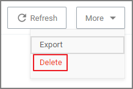
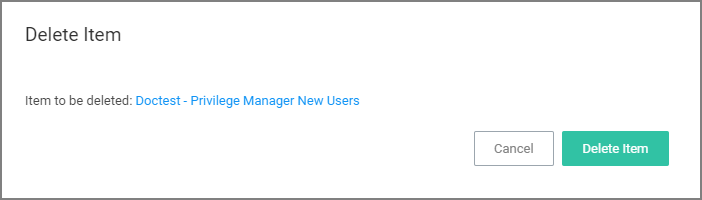

[title]: # (Roles Tab)
[tags]: # (admin,configuration)
[priority]: # (1)
# Roles Tab

The following Privilege Manager roles are available by default and it is possible to add to or remove members from these roles. Privilege Manager also allows the creation of new roles, if a customer environment requires more role support.

<**Note**: Privilege Manager's Roles logic prevents the removal of a user account with an Administrator Role, if that user account is the last with those Administrator Role privileges. Privilege Manager does not allow current users to delete their own account.

>**Note**:
>Privilege Manager manages the roles of users accessing the console, unless Privilege Manager is connected to Secret Server. When connected to Secret Server, role membership is controlled by Secret Server.

Also refer to the following topic: [User Credentials and Roles](../credentials/ui-config-roles-user-credentials.md).

All these roles are considered application role permissions.

## Privilege Manager Administrators

This role allows the Privilege Manager Administrator to have full administrative access to the Privilege Manager Server Console.

## Privilege Manager Field Engineering

This role is reserved for future use.

## Privilege Manager Helpdesk Users

This role allows the user to have approve or deny escalation requests access. The helpdesk role can also disclose passwords.

## Privilege Manager MacOS Administrators

This role allows the Privilege Manager Administrator to have full administrative access to the Privilege Manager Server Console to administer local security and application control items pertaining to macOS systems. This role can view but not edit Windows policies.

## Privilege Manager Users

This role allows the user to have read permissions to most items, but no rights to modify security permissions. This role can disclose passwords.

## Privilege Manager Windows Administrators

This role allows the Privilege Manager Administrator to have full administrative access to the Privilege Manager Server Console to administer local security and application control items pertaining to Windows systems. This role can view but not edit macOS policies.

## Creating/Deleting Roles

To create a new role,

1. On the top of the Roles page, click __Create__.
1. Enter a name for the role, a description, and an account name.
1. Click __Create__.

   Once has been added, the new role's page opens and you can 

   1. Add Users to or edit the role, via __Add__.

      
   1. Delete the role, via __More | Delete__ and then confirm on the Delete Item modal by clicking __Delete Item__.

      

      
