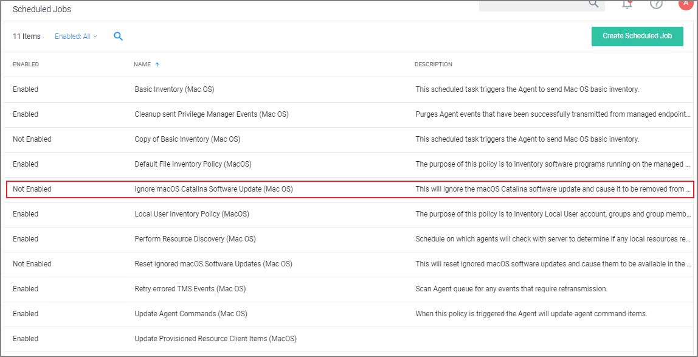
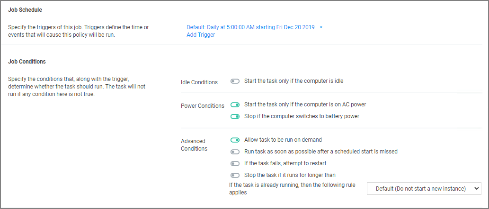

[title]: # (Ignoring macOS Updates)
[tags]: # (macOS, )
[priority]: # (8002)
# Ignoring macOS Updates

>**Important**: This does not apply to macOS systems based on Big Sur (macOS 11.0) or later. The --ignore option is not supported on Big Sur system or any agents installed on Catalina and up using SYSEX.

MacOS has a command-line utility that can be used to ignore specific software updates in the Software Update preference pane. To provide a way in Privilege Manager to ignore or reset ignored OS updates, the following policies are available via configuration feeds.

* The __Ignore macOS Catalina software update (Mac OS)__ - The Ignore macOS Catalina Software Update (Mac OS) policy uses the Run Shell Script (Mac OS) command.

* The __Reset ignored macOS software updates (Mac OS)__ - The Reset ignored macOS Softwares Update (Mac OS). uses the Run Shell Script (Mac OS) command.

## Ignore macOS Catalina software update (Mac OS)

| Parameter | Value |
| ----- | ----- |
| Default Active | No |
| Command | Run Shell Script (MacOS) |
| Parameters | `softwareupdate --ignore "macOS Catalina"` |
| Triggers | Default: Default: Daily at 5:00:00 AM starting Fri Dec 20 2019 | 
| Targets | MacOS Computers |
| Conditions | Idle: None specified by default |
| | Power: Start the task only if the computer is on AC power, Stop if the computer switches to battery power |
| Advanced | On: Allow task to be run on demand |
| | Off: Run task as soon as possible after a scheduled start is missed |
| | Off: Stop the task if it run for longer than 3 day(s). |
| | Off: If the task fails, attempt to restart |
| Rule | Default (Do not start a new instance) |
| Agent Sent Size | n/a |
| Agent Received Size | n/a |
| Restrictions | none |

## Reset ignored macOS software updates (Mac OS)

| Parameter | Value |
| ----- | ----- |
| Default Active | No |
| Command | Run Shell Script (MacOS) |
| Parameters | `softwareupdate --reset-ignored` |
| Triggers | Default: Default: Daily at 5:30:00 AM starting Fri Dec 20 2019 | 
| Targets | MacOS Computers |
| Conditions | Idle: None specified by default |
| | Power: Start the task only if the computer is on AC power, Stop if the computer switches to battery power |
| Advanced | Allow task to be run on demand |
| | Off: Run task as soon as possible after a scheduled start is missed |
| | Off: Stop the task if it run for longer than 3 day(s). |
| | Off: If the task fails, attempt to restart |
| Rule | Default (Do not start a new instance) |
| Agent Sent Size | n/a |
| Agent Received Size | n/a |
| Restrictions | none |

## Configuration Feeds

1. Navigate to __Admin | Config Feeds__.
1. Expand __Privilege Manager Product Configurations__.
1. Expand __Application Control Solution__.
1. Install __Ignore macOS Catalina software update__ and __Reset ignored macOS software updates__.

## Enabling the Policies

Following the config feeds install, you need to enable the policy to ignore the update.

1. Navigate to your macOS Computer Group and click __Scheduled Jobs__.
1. Click on __Ignore macOS Catalina Software Update (Mac OS)__.

   
1. Set the __Inactive__ switch to __Active__.
1. Click __Save Changes__.

## Resetting the Policy

1. To reset the changes, set the ignore updates policy to inactive and save the changes.
1. Navigate to the __Reset ignored macOS Software Updates (Mac OS)__ policy.
1. Set the __Inactive__ switch to __Active__.
1. Click __Save Changes__.

## Scheduling

You can edit when the policy runs by scrolling down to the Job Schedule and Job Conditions section on the policy page.

>**Note**: Once the policies are enabled they do not run immediately. If you would like the policies to run right way you will need to click on the information icon next to Deployment and select the __Resource and Collection Targeting Update__ task.
