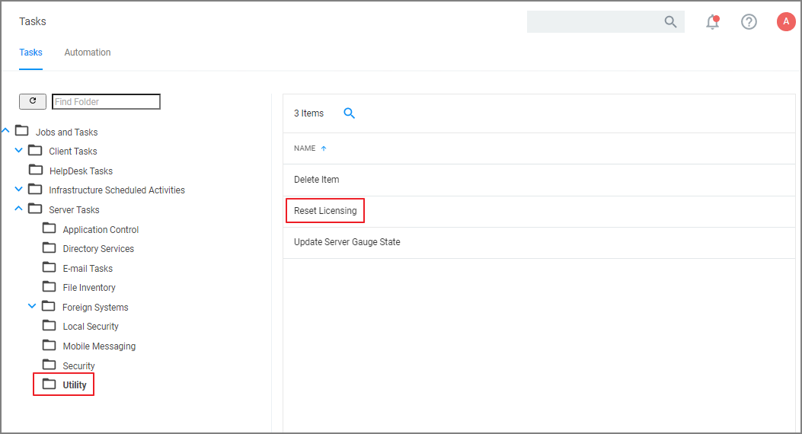
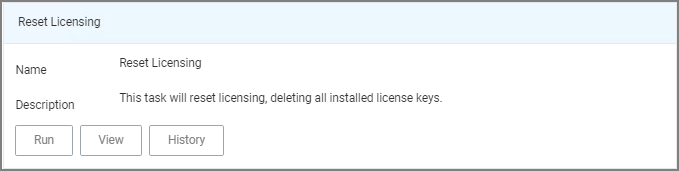
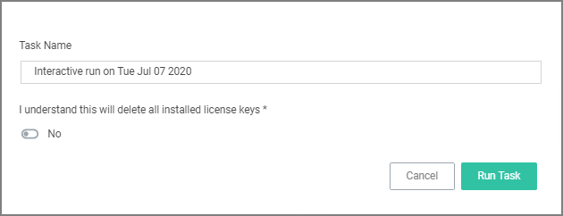

[title]: # (Reset Licensing)
[tags]: # (server utility tasks)
[priority]: # (6002)
# Reset Licensing

With Privilege Manager 10.7 and up license registrations can be reset. The Reset Licensing task allows upgrading users to remove outdated licenses.

After acknowledging the license reset, all licenses are removed from the Privilege Manager instance. When no licenses can be found, the no product licenses warning banner displays on the top of the console.

## Using the Reset Licensing Task

1. Navigate to the __Admin | Tasks__.
1. From the Tasks folder tree, select __Server Tasks | Utility__.
1. From the options on the right, select __Reset Licensing__.

   

   Reset Licensing is a read-only task.

   
1. Click __Run__.

   To run the task, the user needs to acknowledge the removal of all installed license key.

   

   The task does not run without that acknowledgement and an error is generated.

>**Note**: Do not use the scheduling functionality on this task. After a license reset, new licenses should be applied ASAP.

To re-apply licenses refer to the information under [Licensing](../../getting-started/licenses.md) in the Getting Started section.
