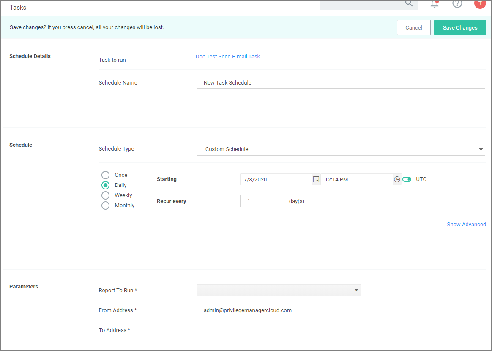

[title]: # (E-mail Reports)
[tags]: # (scheduled tasks)
[priority]: # (5)
# E-mail Reports Task

Any report created in Privilege Manager can be sent to a group of recipients based on a scheduled task.

To set this up, create a new Server task to send emails.

1. Navigate to __Admin | Tasks__.
1. In the folder tree open __Server Tasks | E-mail Tasks__.

   
1. Click __Create__. For on-prem instances the modal has an SMTP Server selection option, for cloud instances the server defaults to a pre-configured value and does not have the SMTP Server field.

   
1. From the Template drop-down select __Send E-mail Task__.
1. Enter the task name and description.
1. If this is for an on-premises instance, for __SMTP Server__, search for your SMTP server that is already configures as a foreign system for your instance.
1. Click __Create__.

   

>**Note:** For cloud environments the SMTP server settings are pulled from an existing configuration and can't be edited via the parameters tab.

Under __Details__ and __Parameters__ you can change/edit any of the task specific information:

1. From the __Command__ drop-down, select what command you wish to execute, e.g. Email Report Results.
1. From the __Report to Run__ drop-down, search for and select the report you wish to send.
1. In the __From Address__ field enter the sender information you wish to be provided.
1. In the __To Address__ field specify the recipient(s) (this can be a comma-separated list of addresses).
1. Click __Save Changes__.

Under the __Schedules__ section of the page you can specify a schedule for this specific task.
1. Click __New Schedule__.

   

   Set up the schedule specifics for this task.
1. Click __Save Changes__.
