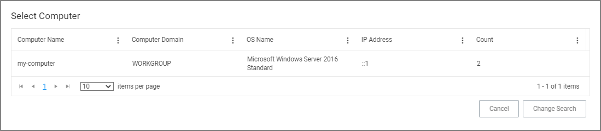
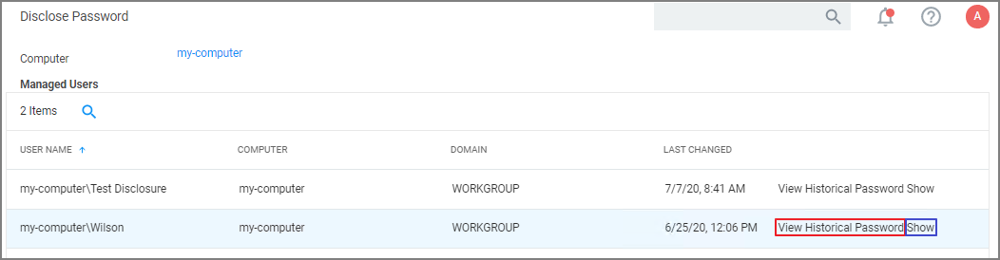
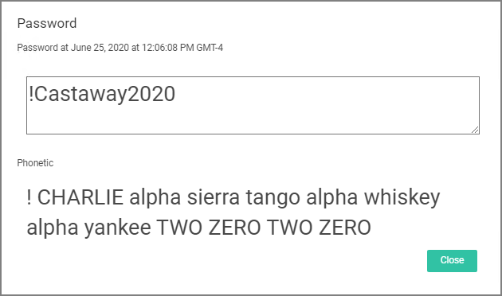
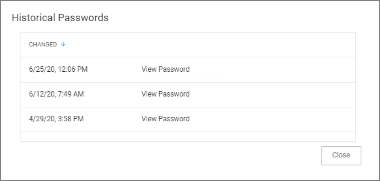

[title]: # (Password Disclosure)
[tags]: # (helpdesk)
[priority]: # (2)
# Password Disclosure

The Password Disclosure tool lets users based on role permissions disclose passwords and look a password rotation history.

The password rotation history is helpful when systems are being restored to a time prior to the current password.

## Using the Disclose Password Tool

1. Navigate to __Admin | Tools: Disclose Password__.
1. The Computer page opens.

   

   Select a computer from the list.

   
1. The Password Disclosure page opens, it list the managed users and also provides links to view the current password and to password history.

   
1. Click on __Show__ to view the current password.

   
1. Click on __View Historical Password__ to view the password history.

   

   Select a link on the __Historical Password__ modal to view any of the rotated passwords.

   

>**Note**: Any password disclosure is audited and can be viewed in the __Password Disclosure History__ report (requires Administrator role membership).
