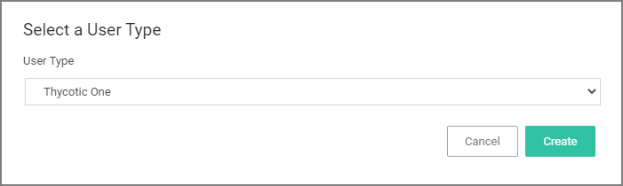

[title]: # (Users)
[tags]: # (admin,configuration)
[priority]: # (16)
# Users

Administrator users can create and edit Privilege Manager users and assign and remove roles for these users.

There are three types of users:

* Thycotic One users - these are only available in cloud environments and are manually added.
* API Users - these are available for the public API implementation.
* Standard Users - these are users manually added by an administrator after the initial installation of Privilege Manager.
* Federated Users - 

## How to Manually Add Thycotic One Users

To manually add users to your Privilege Manager cloud instance, follow these steps:

1. Navigate to __Admin | Users__.

   

1. Click __Create__.

   
1. From the __User Type__ drop-down, select __Thycotic One__ and click __Create__.

   
1. From the __Thycotic One Instance__ drop-down, search for and select your instance for the new user.
1. Enter the __Email__ and __Name__ of the new Thycotic One user in the respective fields.
1. Click __Create__.

## How to Manually Add Standard Users

Standard users can view and edit their own accounts, such as password updates, but can't create new users or delete their own user.

1. Navigate to __Admin | User__.

   

   On-prem instances see a note that Thycotic One users can only be created if a Thycotic One Foreign System is configured.
1. Click __Create__.
1. From the __User Type__ drop-down, select __Standard User__ and click __Create__.

   
1. On the __Enter User Details__ modal, enter

   

   1. the __User Name__.
   1. the __Display Name__.
1. Click __Create__.
1. On the newly created User's details page, add

   

   * the user's __email address__
   * a __password__.
   * __roles__ to the user by clicking the __Add roles to a user here__ link. You can create users without assigning roles. To go through the steps of assigning roles, refer to the __Add Roles to a User__ topic below.
1. Click __Save Changes__.

The user is now active in the system and you may edit the user details.

## How to Manually Add API Client Users

API Client users can view and edit their own accounts, such as password updates, but can't create new users or delete their own user.

1. Navigate to __Admin | User__.
1. Click __Create__.
1. From the __User Type__ drop-down select __API Client__ and click __Create__.

   

API Client users are by default created with a date and time reference when the user was added. If you wish, you can modify the display name. The newly create user is automatically set to active on creation. Prior to navigating away from the page, make sure to take note of the __Client ID__ and copy the __Secret__ into your vault.

Make sure the API user is a member of a role, the role depends on what you need the API to do.

Use __Reset Secret__ to generate a new secret for this user, it invalidates the old secret you copied to the vault. Once you click __Reset Secret__ you need to confirm the action. The new secret will be shown until you navigate away from the page.
All changes need to be saved to take effect.

## Add Roles to a User

1. On the __User Details__ page, from the __Add roles to user here__ click __here__.

   
1. From the roles page select the role you want to add to the user, for example _Privilege Manager Windows Administrators_.

​   
1. Click __Edit__.

​   
1. Click the __name__ or __Add__ to add the user to the role.

   
1. Click __Update__.

   
1. Click __Save Changes__ to save the role update.
