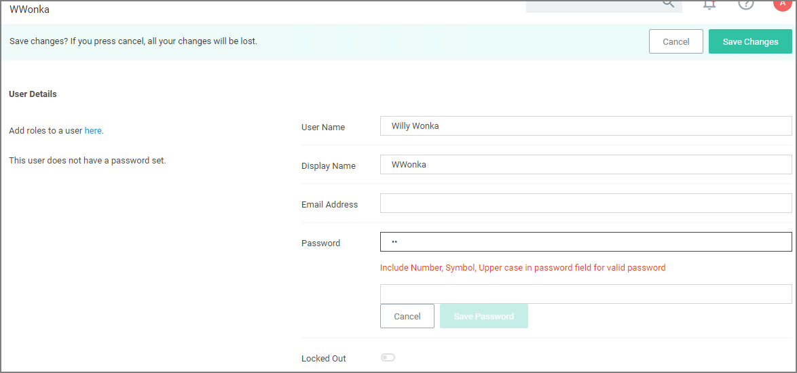

[title]: # (Password Complexity)
[tags]: # (standard users,configuration)
[priority]: # (16)
# Password Complexity Enforcement

Privilege Manager Administrators can turn complex password policy rules on and off for Privilege Manager users. This can be set via the [advanced configuration](../config/advanced/adv-pm-general.md) page. Password complexity is turned on by default.

Policy rules:

* minimum of 8 characters
* minimum 1 symbol
* minimum 1 uppercase
* minimum 1 lowercase

The password policy applies to UI and API Client users.

The enforcement takes effect when a new Privilege Manager user is created or an existing user resource is edited.
