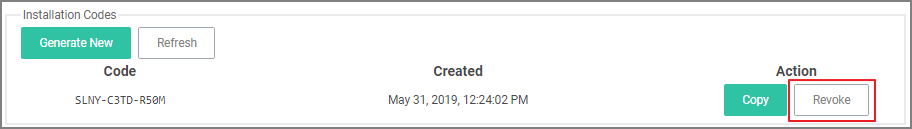
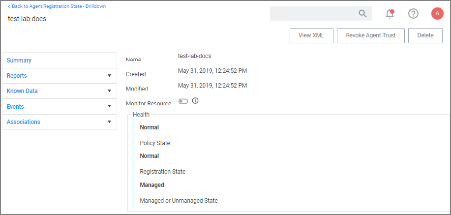
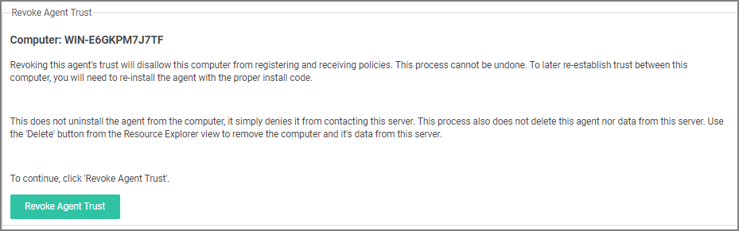

[title]: # (Agent Trust Revocation)
[tags]: # (operations)
[priority]: # (4)
# Agent Trust Revocation

With Privilege Manager 10.5 and up, you can revoke an agent trust relationship.

## Revoking the Trust from the Server

1. Navigate to the Agent Install Code's page and click __Remove Agent Trust__.

   
1. Click __OK__ to confirm.

   

## Revoking the Trust for the Computer Resource

1. Navigate to __Admin | Agents__ to open the Agents Summary page.
1. Select an Operating System group from list.
1. On the Managed Computers by Operating System page, select one of the computer resources.

   
1. Click __Revoke Agent Trust__.

   
1. Confirm by clicking __Revoke Agent Trust__. 

Message on the Revoke Agent Trust dialog:

"Revoking this agent's trust will disallow this computer from registering and receiving policies. This process cannot be undone. To later re-establish trust between this computer, you will need to re-install the agent with the proper install code.

This does not uninstall the agent from the computer, it simply denies it from contacting this server. This process also does not delete this agent nor its data from this server. Use the 'Delete' button from the Resource Explorer view to remove the computer and it's data from this server."
