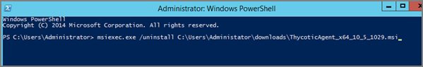

[title]: # (Agent Uninstall Script)
[tags]: # (scripted uninstall)
[priority]: # (5)
# Agent Uninstall Script

This topic covers uninstalling an agent when the endpoint is not going to be upgraded to a new version of Privilege Manager agents anymore.

If you're trying to uninstall an old agent in order to install a newer version of the agent, use the Upgrade Products/Feature link under the Setup page.

## Using a PowerShell Script to Uninstall an Agent

1. Navigate to the machine(s) where the agent is located.
1. Right-click on __Windows Powershell__ and __Run as administrator__.
1. Run the following command:

   ```
   msiexec.exe /x ThycoticAgent_x64_VERSION.msi /qn
   ```
   
1. On the prompt, click __Yes__.
