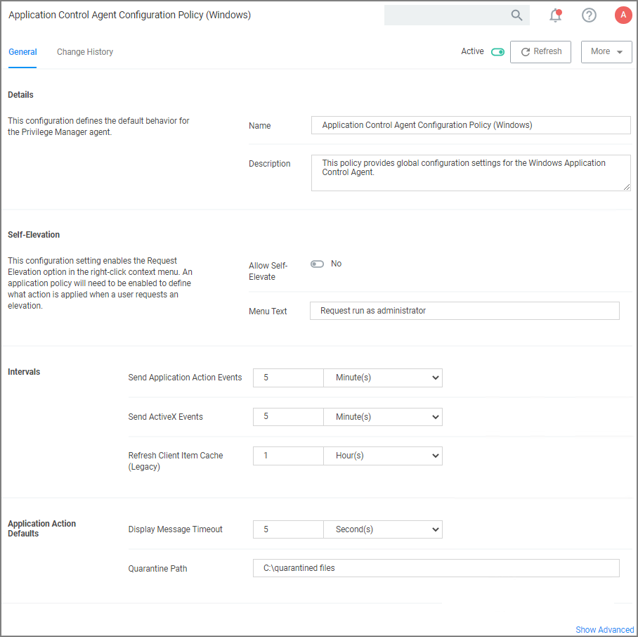

[title]: # (Test Environments)
[tags]: # (agents)
[priority]: # (7)
# Configuring for a Test Environment

You need to set Privilege Manager Agent configuration options to readily test configuration changes in a test environment. The agent configurations outlined in this page allow for accelerated feedback when testing use cases.

1. Under your Computer Group select __Agent Configuration__.

   
1. Under Self-Elevation, set the Request Elevation option. For this an application policy needs to be enabled to define what action is applied when a user requests an elevation. Enter the text for the message in the text field.
1. Under Intervals, adjust the values to receive quicker turnarounds on any tests run on a test instance.
   1. Set Sent Application Action events every to 1 Minutes.
   1. Set Send ActiveX events every 5 Minutes.
   1. Set Refresh Client Items cache every 5 Minutes.
1. Set the __Application Action Defaults__, like the Display Message Timeout and Quarantine Path.
1. Keep the advanced settings as is (Thycotic recommends to only change the advanced settings after consulting via Professional Service engagement.)
1. Click __Save Changes__.
