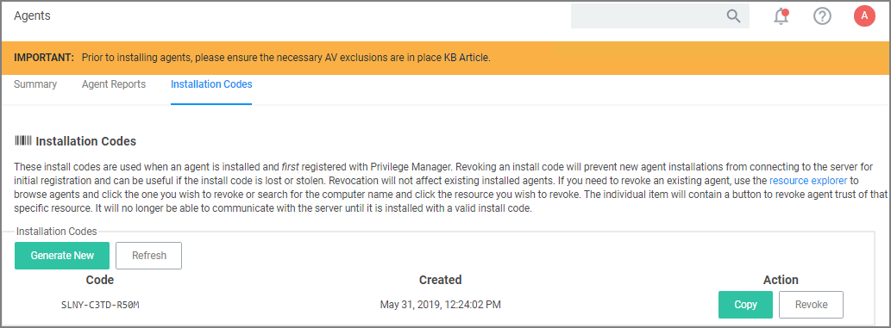

[title]: # (Connecting Agents)
[tags]: # (group policy)
[priority]: # (3)
# Connecting Agents to the Privilege Manager Sever

Regardless of how you installed agents or rolled agents out to your network, Privilege Manager has a method to link those agents with Servers. Privilege Manager has templates (files) that enable you to point agents back to the Privilege Manager Server.

To perform this task, do the following steps:

1. Download the attached [PrivilegeManagerAgent.admx](https://updates.thycotic.net/privilegemanager/Arellia/PrivilegeManagerAgent.admx.zip)  and [PrivilegeManagerAgent.adml](https://updates.thycotic.net/privilegemanager/Arellia/PrivilegeManagerAgent.adml.zip) zip folders and extract the corresponding files (one file from each zip folder).
1. Install the downloaded and extracted custom Privilege Manager Group Policy files either on a single machine or on a domain controller.
   * To install on a single machine:
     1. Copy PrivilegeManagerAgent.admx to `%systemroot%\PolicyDefinitions`
     1. Copy PrivilegeManagerAgent.adml to `%systemroot%\PolicyDefinitions\en-US`
   * To install on a Domain Controller effectively making the custom GPO available to all Domain Administrators:
     1. Copy PrivilegeManagerAgent.admx to `%systemroot%\SYSVOL\domain\Policies\PolicyDefinitions`
     1. Copy PrivilegeManagerAgent.adml to `%systemroot%\SYSVOL\domain\Policies\PolicyDefinitions\en-US`
1. From the Group Policy Management Editor, navigate to Policies.
1. Go to Administrative Templates > Privilege Manager > Agents > Privilege Manager Agent and click Connected Server.

   
1. In the Connected Server window click __Enabled__.
1. In the Server field, __enter__ the __URL__ for your Privilege Manager Server, click __OK__.
1. Now you need to copy some data from Privilege Manager. In Privilege Manager, navigate to __Admin | Agents | Installation Codes__ tab.

   
1. Copy the __Code__ value by clicking __Copy__.
1. Switch back to the Group Policy Editor, in the Privilege Manager Agent window, click Install Code.

   
   1. In the Install Code window, click __Enabled__.
   1. In the Install Code field, paste the Code value you copied from Installation Codes tab in Privilege Manager.
   1. Click __OK__.
1. Set the Client Item Signature Validation. By default, Privilege Manager validates only client items that have a signature present. If you want to require that all client items have a valid signature, then configure the group policy settings to enforce the __Require Signed Client Items__ setting.

<!--TODO: Explain Required Signed Client Items-->

## Un-Installing Old Templates

If you had previously downloaded and installed files which had the names "AMSAgent.admx" and "AMSAgent.adml", these should be removed. Do so as follows:
* To un-install from a single machine: 
  1. Delete AMSAgent.admx from `%systemroot%\PolicyDefinitions`
  1. Delete AMSAgent.adml from `%systemroot%\PolicyDefinitions\en-US`
* To un-install from a Domain Controller:
  1. Delete AMSAgent.admx from `%systemroot%\SYSVOL\domain\Policies\PolicyDefinitions`
  1. Delete AMSAgent.adml from `%systemroot%\SYSVOL\domain\Policies\PolicyDefinitions\en-US`
