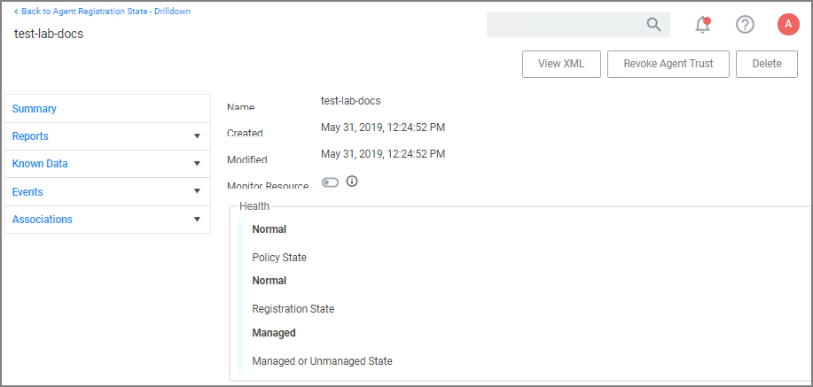

[title]: # (Agents)
[tags]: # (endpoints)
[priority]: # (1900)
# Privilege Manager Agents

The [Privilege Manager Agents](../install/agents/index.md) are a critical component of Thycotic's application control and local security, giving you the ability to evaluate the health and status of endpoints in real time. Agents are required on endpoint machines to implement Privilege Manager policies.

Privilege Manager provides pre-configured and fully customizable reporting on the status of agents and endpoint operating systems. In the Privilege Manager reporting dashboard, you can drill into reports based on any dimension and easily export report data to other reporting applications or Excel.

Privilege Manager supports agents on:

* Windows
* macOS
<!-- * Unix/Linux -->

endpoint operating systems.

For information about installing agents, refer to [Agent Installation](../install/agents/index.md) to review agent system requirements and the specific agent installation procedures. This section of our document is a general agent information section, containing details about how to use/interact with agents and to provide information about the agent processes.

## Agent Hardening (Windows)

To make sure that local Administrators do not tamper with Thycotic agents running on their system, Privilege Manager Administrators can define users that can start and stop the Privilege Manager services running on endpoints, such as the Thycotic Agent or Thycotic Application Control. Refer to [Agent Hardening](win/agent-hardening.md).

## Post Agent Installation

When your agents are installed, you can verify the status of your Agents' health in terms of Registration State and Policy State from the Home page. You also can navigate to __Admin | Agents__ for more information about installed agents.

The Agent Health dials describe how many Managed Operating Systems you have as well as your Agent(s) Registration State and Policy State. If you click on the Agent Registration State dial, you will see a report on a list of machines (the "MonitoredResource" column) where each registered agent is installed.

Clicking the Agent Policy State dial from the Home dashboard brings you to a report that links all of your agent-registered machines with the Number of Policies Missing from each agent. This page will become invaluable once you have multiple policies running over different computer groups in your network.

### Agent Diagnostics

Once your agents are installed, verify that they have registered in Privilege Manager. Navigate to either:

* __Admin | Diagnostics__ to access the __Diagnostics__ page or

  
* __ADMIN | Agents__ to view your agent details.

  

After the initial policies are received, future updates will be based on the task schedules set in Update Applicable Policies and Scheduled Registration policies. Ensure to select the correct policies based on Windows or Mac operating systems. To edit these schedules, navigate to your computer group and select __Scheduled Jobs__. The __Triggers__ can be customized under the __Job Schedule__ section.  
  
On the agent details page you will see the quantity of agents registered and what operating system is running on registered endpoints. Registered endpoints can also be viewed in the report __Agent Installation Summary__ by navigating to the __Agent Reports__ tab.  
  

From the the reports pages you can click into any of the __target machines__ listed that have a Thycotic agent installed. Pictured below is a view from one of these resource pages where you can check the machine's System Health and configured policies.

## Agent Encryption

The agent traffic is secured via SSL/TLS (1.2).

<!-- Post 10.7.1 release create a general agent section in the TOC to cover more general information and conceptual write-up. Remove this heading here and create more contents in that new agent section. -->

## Elevated Processes

Starting with Privilege Manager version 10.8.2, the agent adds memory checks for all processes that are managed/elevated via Privilege Manager. Any processes not managed by Privilege Manager, should be checked for process hollowing through means of products like Windows Defender ATP.
