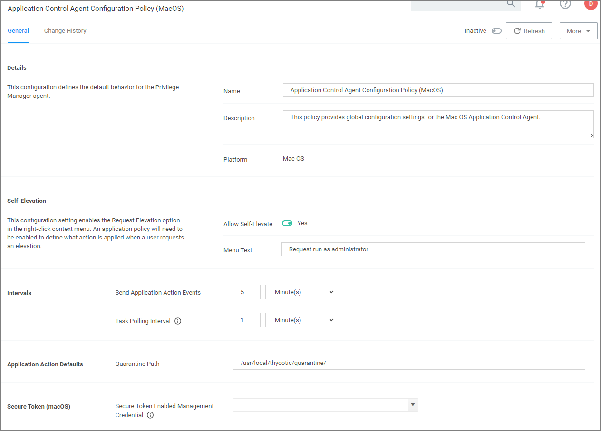

[title]: # (Agent Configuration)
[tags]: # (computer groups)
[priority]: # (1)
# Agent Configuration

Under each macOS Computer Group administrators can specify global application control agent settings for the specific Computer Group.

* Details: This sections contains the policy details such as name, description, and platform information.
* Self-Elevation: This sections provides a configuration option to enable the Allow Self-Elevation option. An application policy will need to be enabled to define what action is applied when a user requests an elevation. The menu text can be customized via the Menu Text field.
  * Default: Request run as administrator
* Intervals: This sections provided a configuration option to customize the intervals at which the agent will send application action events or how often a Mac OS Agent will callback to the server to see if any tasks have been requested of it.
  * Defaults:
    * Send Application Action Events: 5 Minutes
    * Task Polling Interval: 1 Minute
* Application Action Defaults: This section provides the option to set the quarantine path.
  * Defaults:
    * Quarantine Path: /usr/local/thycotic/quarantine/
* Secure Token (macOS): This section provides an option to specify a macOS admin account that is Secure Token enabled. This account must exist on all LSS managed macOS endpoints.
