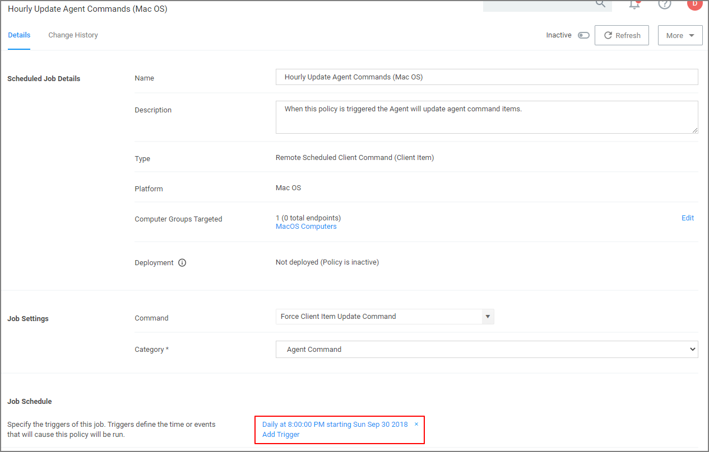
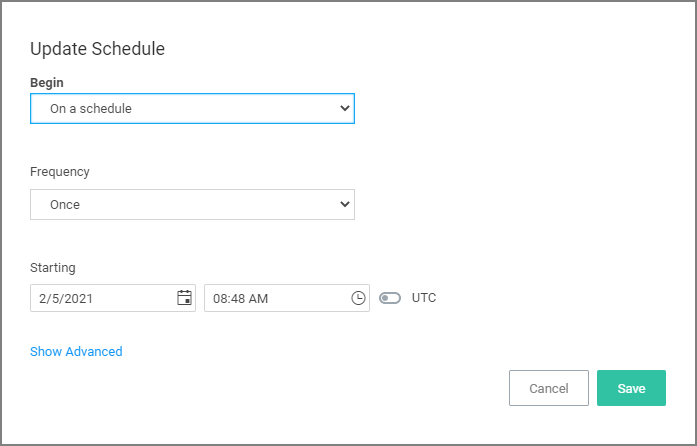
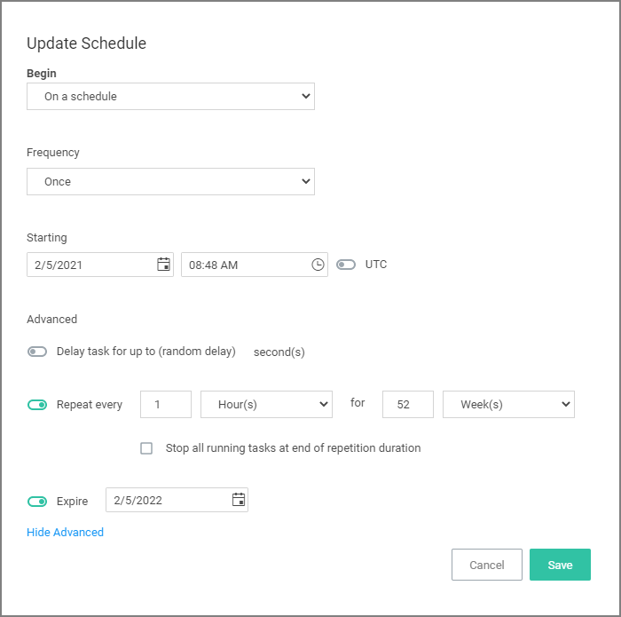
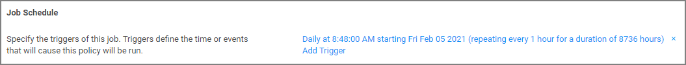

[title]: # (macOS Agents)
[tags]: # (endpoints)
[priority]: # (3)
# Modify Update Agent Commands (MacOS) Policy

Agents receive new policies on a schedule which can be modified. By default this schedule runs daily at 8 pm.

To create a modified schedule, you have to duplicate the default Scheduled Job and customize the duplicate:

1. Under your macOS computer group, select __Scheduled Jobs__.
1. Search for and select __Update Agent Commands (Mac OS)__.
1. Click __Duplicate__.
1. Enter a name for this duplicated task that reflects its purpose, e.g. if it is supposed to run hourly, reflect it in the name.
1. Click __Create__.

   
1. Under the Job Schedule section,
   1. Click on the __x__ to remove the _Daily at 8:00:00 PM ..._ schedule.
   1. Click __Add Trigger__.
      
   1. For the __Begin__ drop-down, keep the __On a schedule__ selection.
   1. For the __Frequency__ drop-down, select __Daily__.
   1. Click __Advanced__.
   1. Make the changes to run the task hourly and specify for how long. For this example we selected to run this task hourly for 52 weeks with an expiration date of one year from the starting date. Setting an expiration date is not required.

      
   1. Click __Save__.
1. Click __Save Changes__.

   
