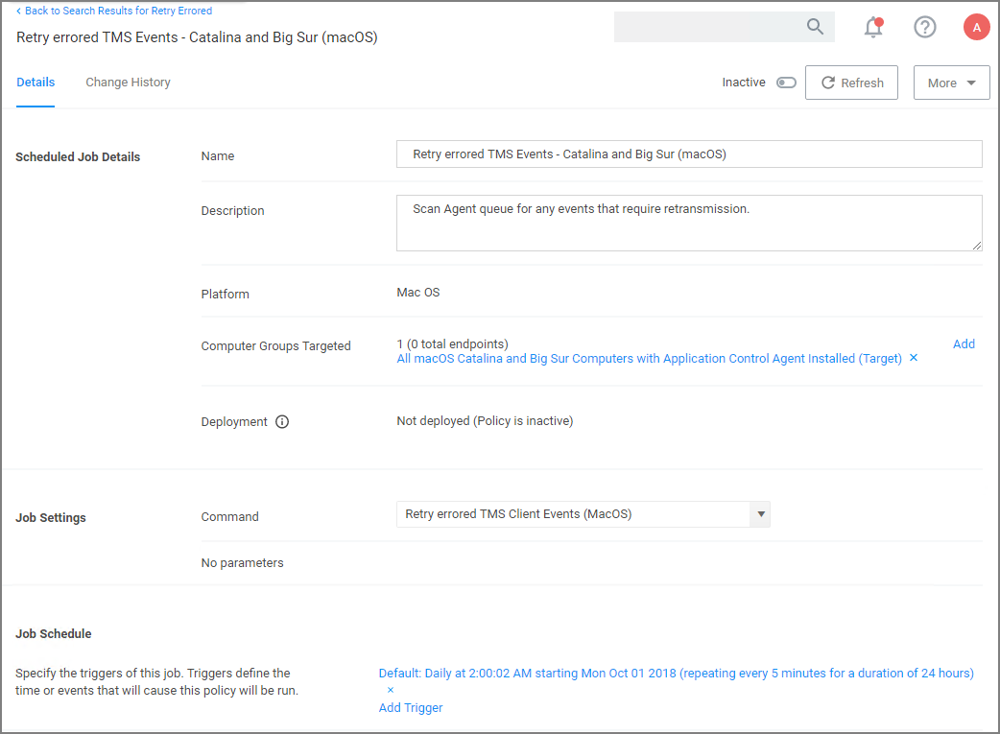

[title]: # (macOS - FileSystemWatcher)
[tags]: # (catalina,big sur)
[priority]: # (14)
# Catalina FileSystemWatcher Issue

There is a known issue on macOS Catalina and later versions, preventing the the agent from receiving notification of events that need to be sent to the server. To workaround this, the __Retry errored TMS Events - Catalina and Big Sur (macOS)__ policy can be enabled to ensure all events get sent to the server.

The defaults for this new Remote Scheduled Client Command are as follows:

* Customize the schedule if necessary to best suit your particular implementation.
* The default resource targets required are specified by default as __All macOS Catalina and Big Sur Computers with Application Control Agent Installed (Target)__. The results of the computer group include any macOS Catalina computers that have the agent installed and are properly configured for Application Control.

Once the policy is enabled on an endpoint, the agent will perform the __Retry errored TMS Client Events (MacOS)__ command and send any events that have not been sent.
