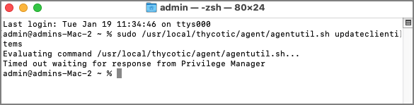
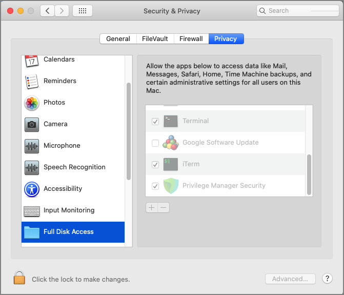

[title]: # (Timed Out Sudo Command)
[tags]: # (catalina,big sur)
[priority]: # (11)

# Sudo Command Timed Out

Some users running **Privilege Manager agent 10.8.1019** and above on **macOS 10.15** and above may experience an issue running `sudo` commands in Terminal, with the following output:

```bash
Evaluating command \<command\>...

Timed out waiting for response from Privilege Manager
```



The Privilege Manager macOS agent v.10.8.1019 introduced a new feature called the **sudo plugin**. This allows you to give privileges to specific commands that are run with `sudo`.

However, the plugin requires Full Disk Access to be granted to the agent. If it is not, then the plugin will fail to evaluate, and you may be prevented from running any `sudo` commands at all on the endpoint.

To grant Full Disk Access to the Privilege Manager agent manually, go to **System Preferences \> Security & Privacy \> Privacy \> Full Disk Access** and check the box next to **Privilege Manager Security.**



To grant Full Disk Access to the Privilege Manager agent via an MDM Profile, follow the instructions outlined [here](../mdm-profiles.md)

After the agent is given Full Disk Access, `sudo` commands should begin to evaluate successfully. An agent or machine restart may be necessary.
