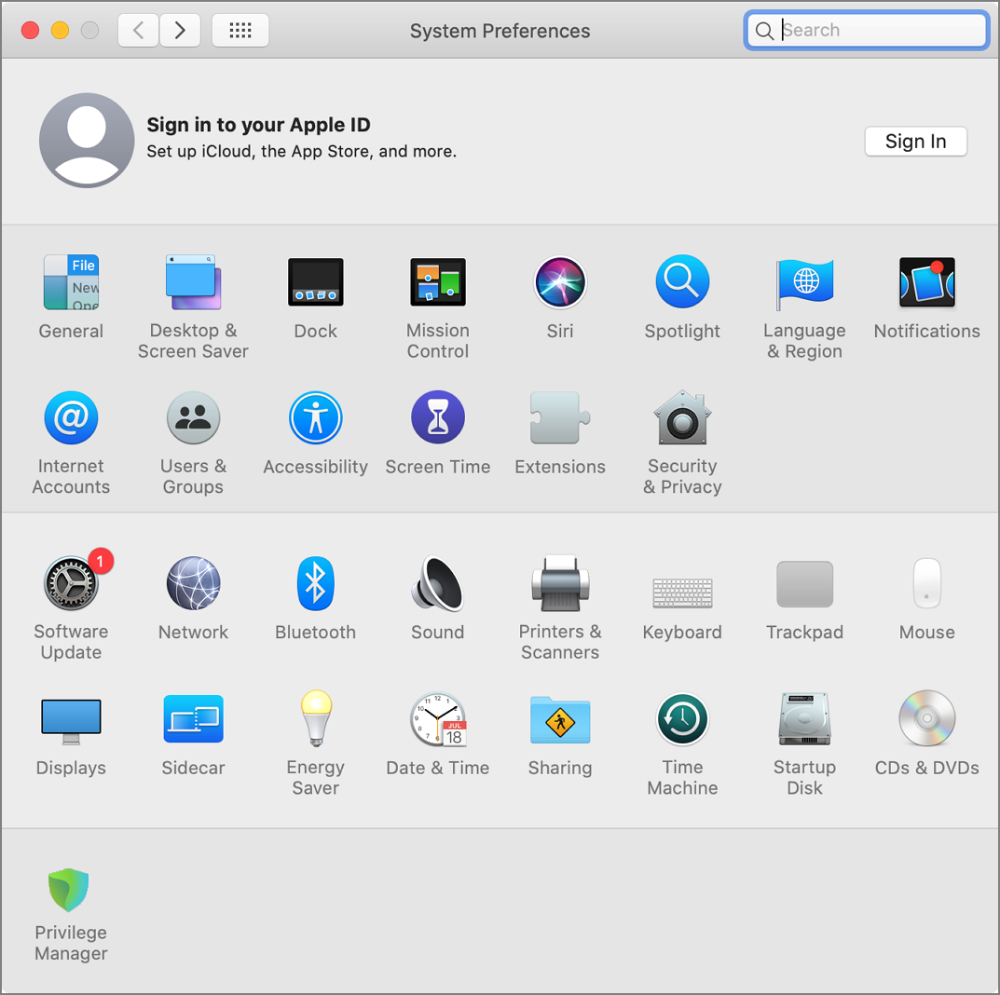
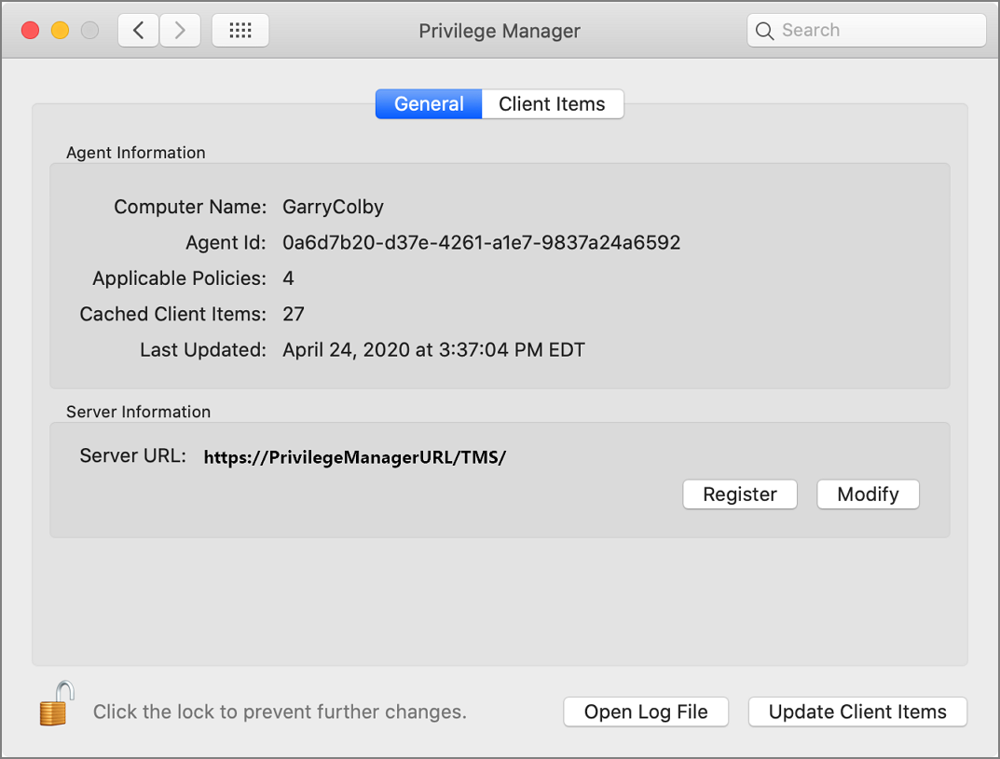
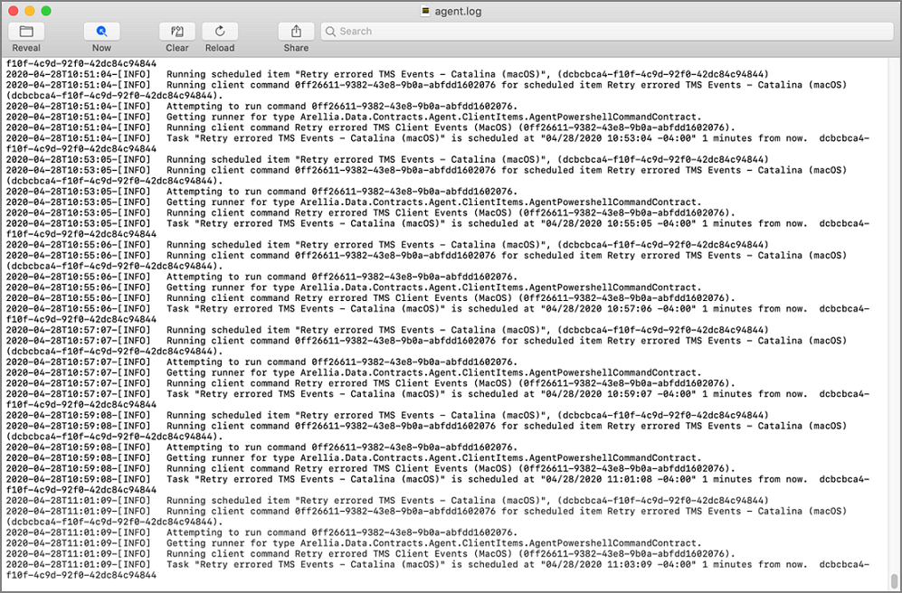
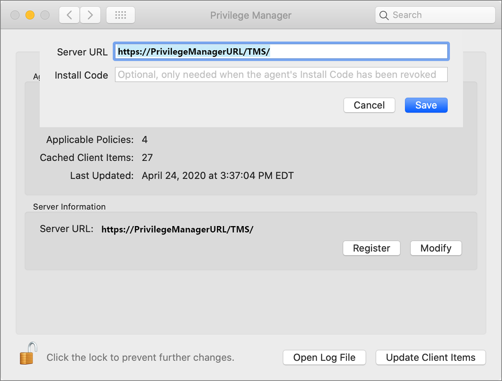
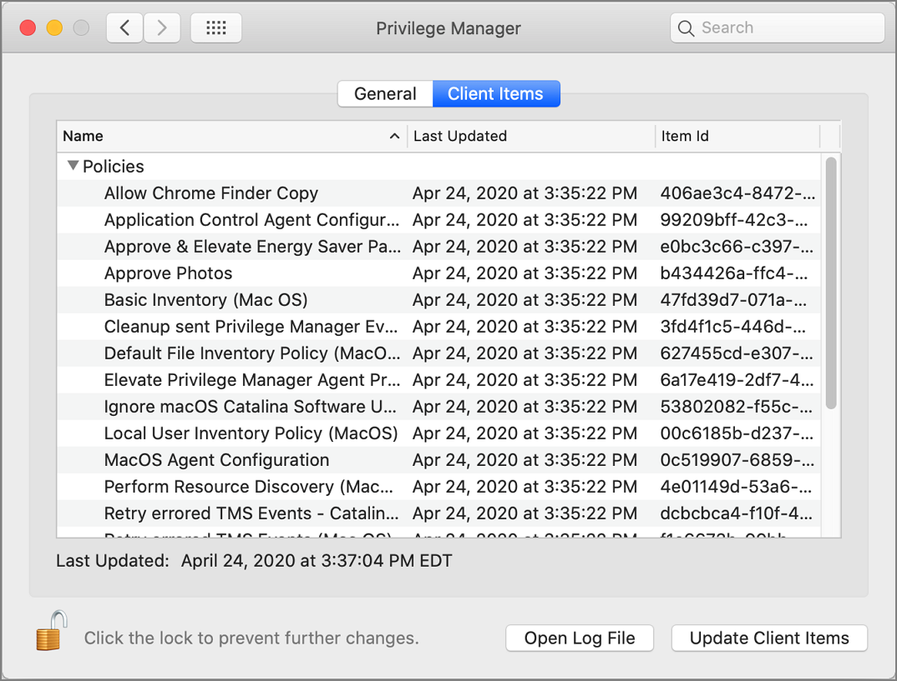
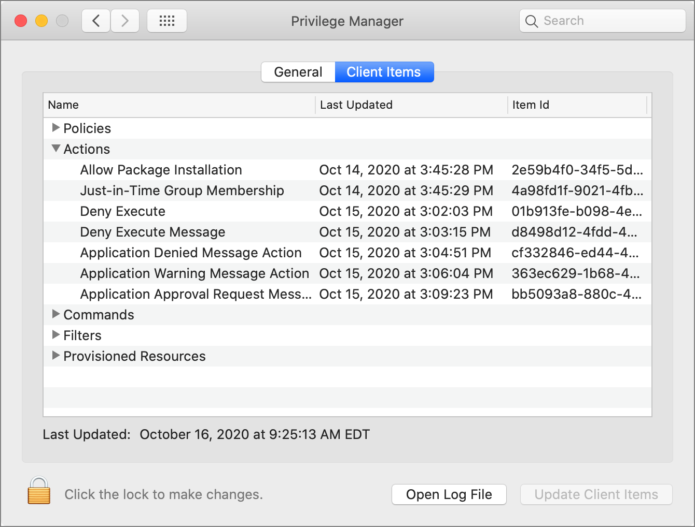

[title]: # (Agent Utility)
[tags]: # (endpoints)
[priority]: # (2)
# MacOS Agent Utility

With the 10.8 release of Privilege Manager, Thycotic is introducing a UI based macOS Agent Utility. The utility provides functionality previously only available via Terminal shell commands. The utility allows customers to easily troubleshoot by

* checking an endpoint status.
* view an endpoint cache.
* view logs in log viewer.
* export logs.

It also offers UI guided means to

* register the agent with the server.
* update the endpoint to retrieve latest policies.

## Accessing the Agent Utility

To access the Privilege Manager macOS Agent Utility, 

1. Open the System Preference pane on your macOS endpoint.

   
1. Click __Privilege Manager__ to open the utility.

## General Tab

When a local admin user opens the utility, the pane pages are unlocked. For standard users they are locked, but can be unlocked by providing an administrator user name and password, just as possible with all other preference panes.

On the general tab the utility provides under __Agent Information__ details like the Computer Name, Agent Id, the number of applicable policies and client items cached. It also provides the data/time stamp of the last update.

Under __Server Information__ the Server URL for the current agent registration is listed. Here, administrator users can either Register a not yet registered agent, or modify an existing agent registration.

Use __Open Log File__ to open the agent's log file.

Use __Update Client Items__ to trigger a client item update. When __Update Client Items__ is clicked and if there are updates to applicable policies or policies are added to the endpoint, the last updated timestamp will change to reflect when the last client items change on the endpoint happened. The date/time stamp does not reflect when the last update client items command ran, the date/time stamp only updates when there was an actual change on the endpoint.

### Registering/Modifying an Agent

To register an agent or to modify and existing agent registration via agent utility, follow these steps:

1. Open the Privilege Manager agent utility.
1. On the General tab under Server Information click Register or Modify.

   
   1. Enter the __Server URL__ for the agent registration or modified registration.
   1. If the agent has been installed without an install code or the agent's registration was revoked, provide an install code to register the agent.
   1. Click __Save__.

## Client Items Tab

The Client Items tab provided an overview of all client items on the endpoint. The client items are grouped into the following categories:

* Policies
* Actions
* Commands
* Filters

The following image shows the client items on the endpoint, in an unlocked utility with policies expanded.

Use expand/collapse to better navigate through the list of applicable client items on the endpoint. The following image shows the client items on the endpoint, in a locked utility with policies collapsed.

