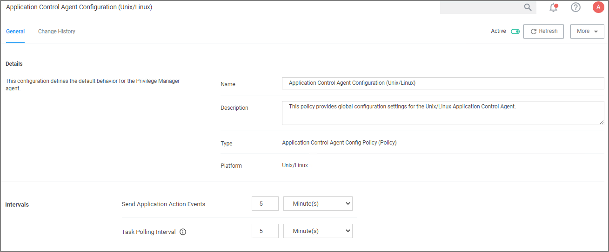

[title]: # (Agent Configuration)
[tags]: # (computer groups)
[priority]: # (1)
# Agent Configuration

Under each Unix/Linux Computer Group administrators can specify global agent settings for the specific Computer Group.

* Details: This section contains the policy details such as name, description, and platform information.
* Intervals: This section provides a configuration option to customize the intervals at which the agent will send application action events and Task Polling.
  * Defaults:
    * Send Application Action Events: 5 Minutes
    * Task Polling Interval: 5 Minutes
