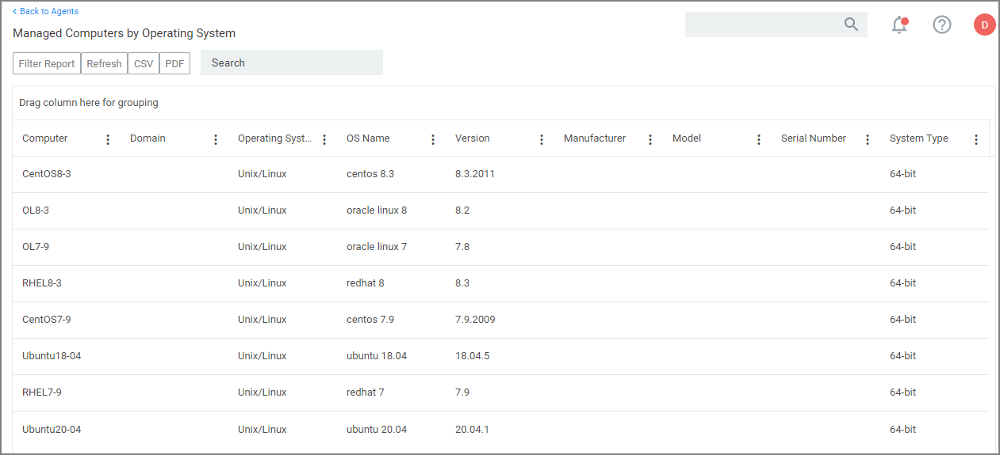

[title]: # (Registration/Status)
[tags]: # (endpoints)
[priority]: # (3)

# Agent Registration and Status

To view agent registration and status information, navigate to __Admin | Agents__.

The __Summary__ tab provides gauges for

* Managed Operating Systems
* Agent Registration State
* Agent Policy State
* Password Age

Clicking the gauges opens drilldown reports.

The table grid list all endpoint operating systems and the number of endpoints with that operating system. Selecting Unix/Linux shows the list of all agents registered with Privilege Manager, providing the

* Computer Name
* Operating System
* OS Name
* Version
* System Type

Clicking on a computer in the list, opens the resource page.

