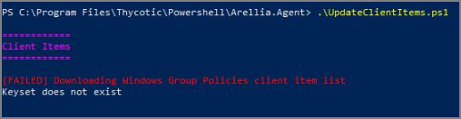
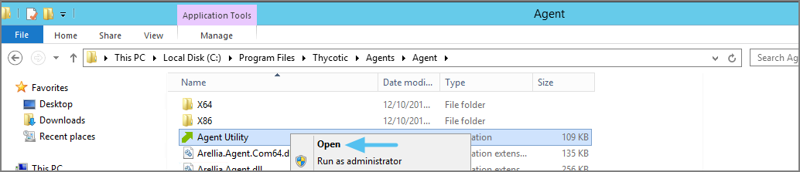
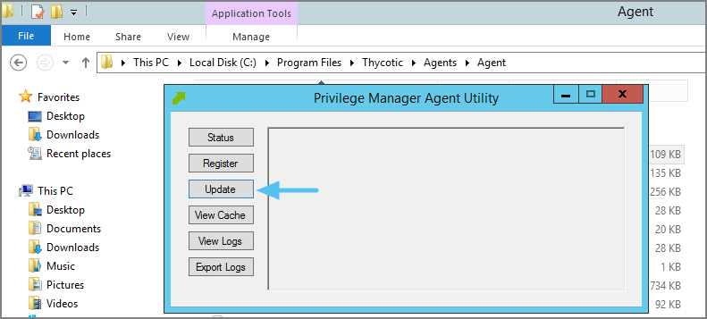

[title]: # (Agent ps1 Error)
[tags]: # (agents)
[priority]: # (12)
# Agent updateclientitems.ps1 Error

While running the `updateclientitems.ps1` powershell script on a machine, you receive the following error:

"KeySet does not exist"



>**Note**:
>The best practice to updating policies on machines would be to run the Agent Utility versus the PowerShell script.
If you are still receiving the same error when using the Update button on the Agent Utility, open up a support case and include a screenshot of the error in the Agent Utility along with the agent logs.

1. Navigate to the Machine(s) where you want to update the policy and open the Agent Utility.

   ```
   C:\Program Files\Thycotic\Agents\Agent
   ```
   
1. Select __Update__.

   
