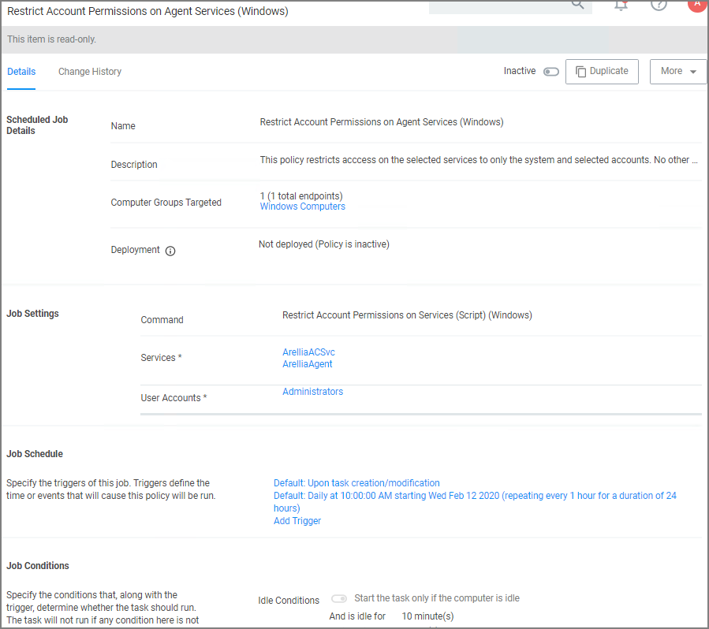
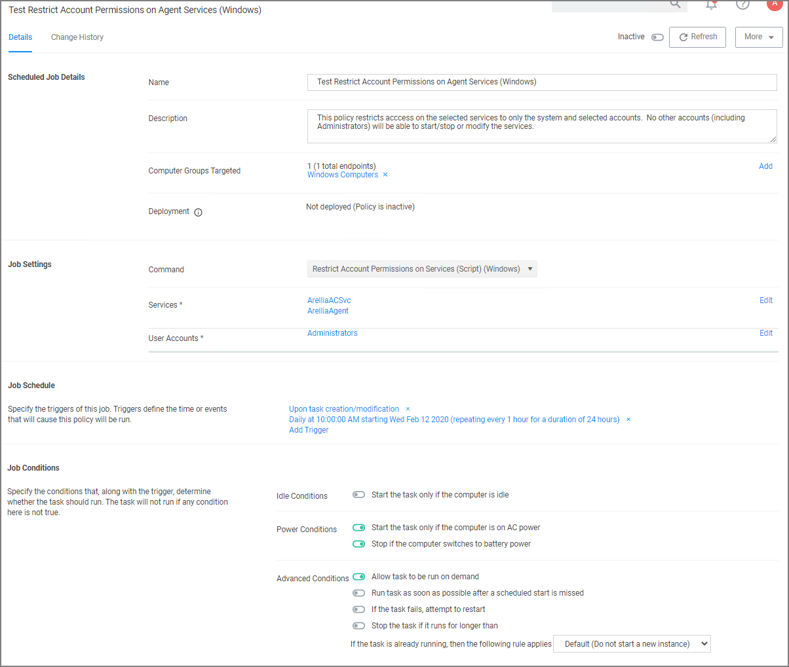

[title]: # (Agent Hardening)
[tags]: # (endpoint,hardening, 10.7.1 and up)
[priority]: # (1620)
# Agent Hardening 10.7.1 and up

Agent installations on endpoints can be secured, only allowing a specified user access to start or stop an agent service and denying any agent control access to a local Administrator or basic user account.

To make sure that local Administrators do not tamper with Thycotic agents running on their system, Privilege Manager Administrators can define users that can start and stop the Privilege Manager services running on endpoints, such as the Thycotic Agent or Thycotic Application Control.

A user or group needs to be available in Privilege Manager to be selected while setting up the task. This user or group will have rights to start and stop agent services running on endpoints once the __Restrict Account Permissions on Agent Services (Windows)__ policy is enabled.

>**Note**:
>If you implemented Agent Hardening prior to 10.7.1, __disable__ and __delete__ the following policies:
> * Agent Service Start / Stop Control (Windows)
> * Agent Service Clear Restrictions (Windows)

## Editing the Restrict Account Permissions on Agent Services (Windows) Policy

1. Under your Computer Group, select __Scheduled Jobs__.
1. Search for __Restrict Account__.

   
1. Click on the __Restrict Account Permissions on Agent Services (Windows)__ policy.

   
1. To customize the policy click __Duplicate__.

   
1. Customize the name of the copied policy and click __Create__.

   
1. Customize the policy's 
   * Scheduled Job Details.
   * Job Settings.
   * Job Schedule.
   * Job Conditions.
   1. Under __Services__ the Arellia Application Control Service and Arellia Agent Service are present by default. Add any services you might also want to protect. Use the search field to find and specify other service names.
   1. For __User Accounts__ use __Edit__ and use the search field to find specific user accounts that have permissions to make changes to the specified services. Administrators are present by default, if you wish to limit to only a subset of users with administrative rights, create a group and update accordingly.
1. Click __Save Changes__.
1. Set the policy to __Active__.

>**Note**: If you wish to update a hardened agent, refer to information under the topic [Windows Agents | Hardened Agents](../../install/agents/win/agent-inst-win.md#hardened_agents).
