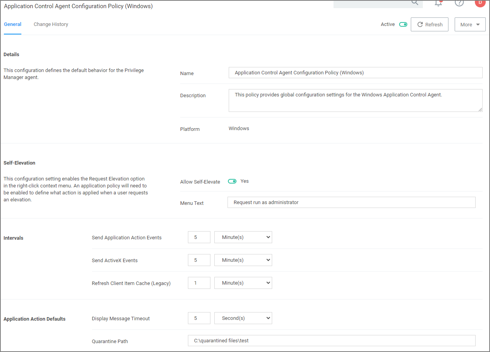
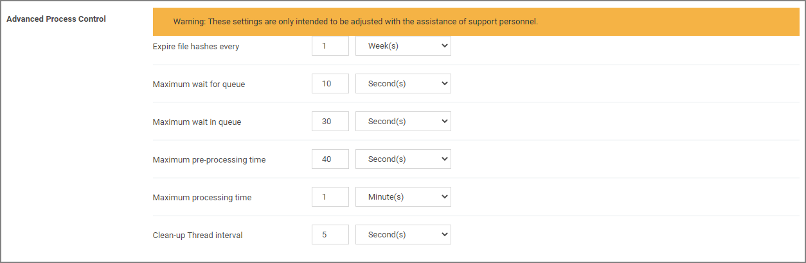

[title]: # (Agent Configuration)
[tags]: # (computer groups)
[priority]: # (1)
# Agent Configuration

Under each Windows Computer Group administrators can specify global application control agent settings for the specific Computer Group.

* Details: This sections contains the policy details such as name, description, and platform information.
* Self-Elevation: This sections provides a configuration option to enable the Request Elevation option in the right-click context menu. An application policy will need to be enabled to define what action is applied when a user requests an elevation. The menu text can be customized via the Menu Text field.
  * Default: Request run as administrator
* Intervals: This sections provided a configuration option to customize the intervals at which the agent will send application action events, ActiveX events and refreshes the client item cache (this is a legacy items for agent version prior to 10.7.0).
  * Defaults:
    * Send Application Action Events: 5 Minutes
    * Sent ActiveX Events: 5 Minutes
    * Refresh Client Item Cache (Legacy): 1 Minute
* Application Action Defaults: This section provides the option to set the display message timeout and the quarantine path.
  * Defaults:
    * Display Message Timeout: 5 Seconds
    * Quarantine Path: C:\quarantined files\test

## Advanced Settings

At the bottom of the page is an __Show Advanced__ link. Settings under this section are Advanced Process Control settings that should only be adjusted with assistance of support personnel and prior discussion of necessity for the environment.

