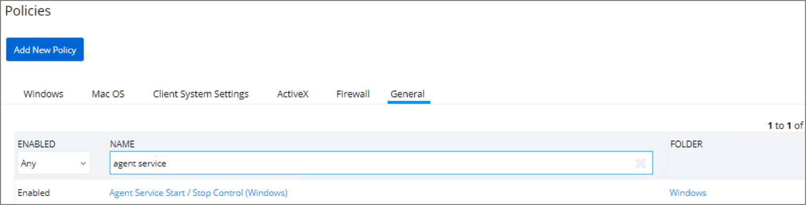
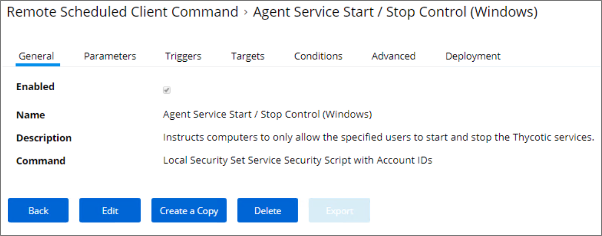
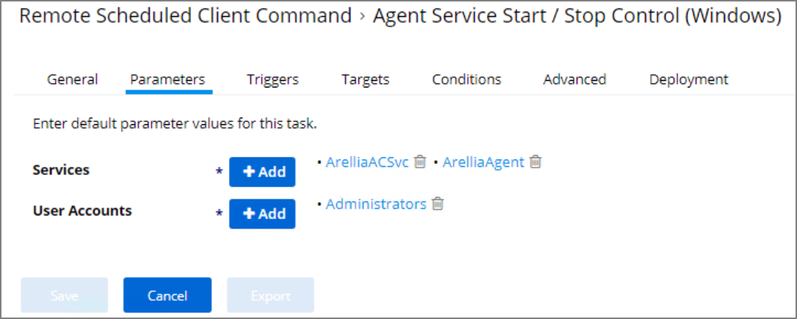
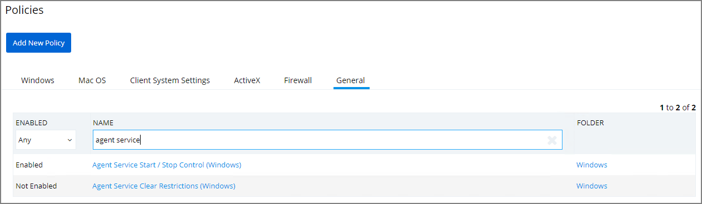
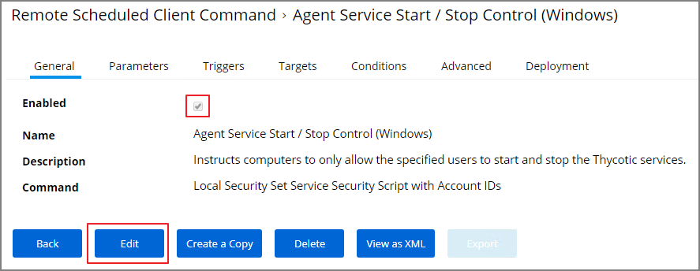
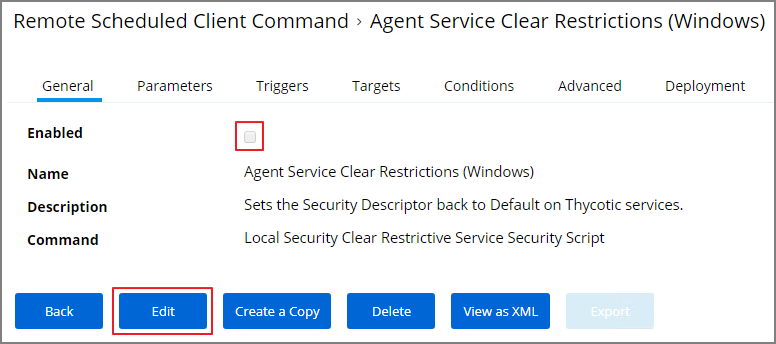

[title]: # (pre-10.7.1 Agent Hardening)
[tags]: # (endpoint,pre-10.7.1)
[priority]: # (21)
# Pre-10.7.1 Agent Hardening

Users on Privilege Manager 10.7.1 or up should use the new policy named __Restrict Account Permissions on Agent Services (Windows)__. Refer to [Agent Hardening 10.7.1 and up](agent-hardening.md) for details on the policy used starting with Privilege Manager 10.7.1.

## Editing the Agent Service Start / Stop Control (Windows) Policy

1. Navigate to __ADMIN | Policies__.
1. Click on the __General__ Tab.
1. In the Name field enter __Agent Service Start / Stop Control__.

   
1. Click on the __Agent Service Start / Stop Control (Windows)__ policy.

   
1. To customize the Agent Hardening policy navigate to the __Parameters tab__.
1. Click __Edit__.

   
1. Under __User Services__ click the __+__ button and use the search field to select the Services to be targeted by the task
1. Under __User Accounts__ click the __+__ button and use the search field to find the specific user account that has permissions to make changes to the Agent services.
1. Click __Save__.

>**Note**: If you require a rollback of the agent hardening due to upgrade issues, use the manual Restore Default Agent Permissions procedure following below.

## Restore Default Agent Permissions

If you need to rollback agent hardening on your endpoints, follow these steps to restore the default agent permissions:

1. Navigate to __ADMIN | Config Feeds__.
1. Expand __Privilege Manager Product Configuration Feeds__.
1. Expand __Thycotic Management Server Core__.
1. Install __Reset Agent Service Permissions__.

Following the Configuration Feed installation,

1. Navigate to __ADMIN | Policies__ and select the General tab.
1. Search for the agent service policies and select to edit.

   
1. Disable the __Agent Service Start / Stop Control (Windows)__ policy.
   1. Click __Edit__.
   1. Deselect __Enabled__.

   
   1. Click __Save__.
1. Enable the __Agent Service Clear Restrictions (Windows)__ policy.
   1. Click __Edit__.
   1. Select __Enabled__.

   
   1. On the Targets tab specify the computers that need to be targeted by this policy.
   1. On the Triggers tab specify when to run and/or what events will trigger the policy to run.
1. Click __Save__.

