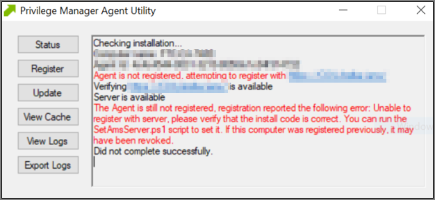
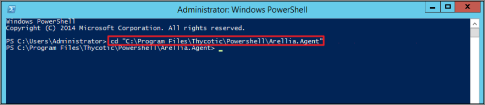
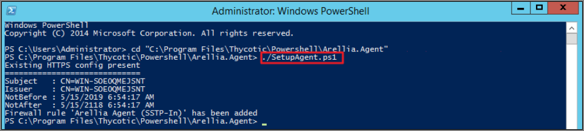
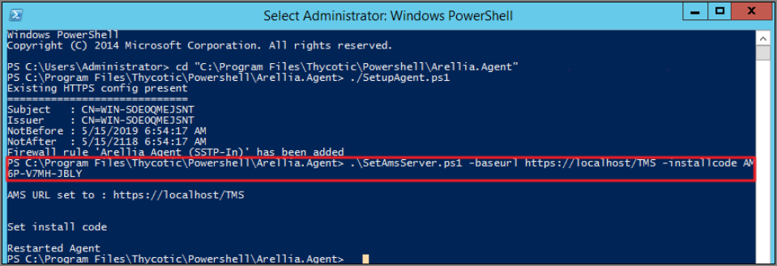
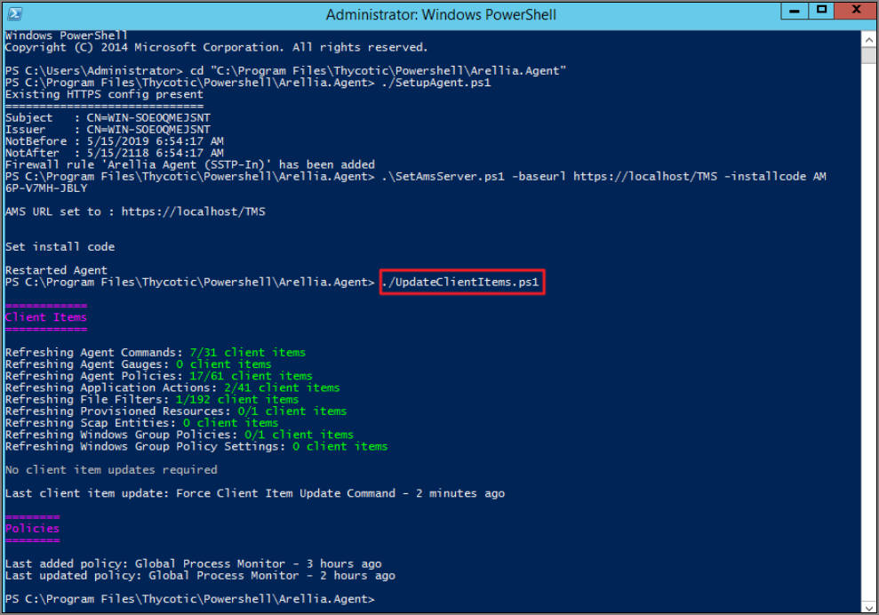

[title]: # (Agent Registration)
[tags]: # (agents)
[priority]: # (12)
# Agent Registration Issue

After upgrading, you encounter the following issue with the Agent utility after selecting "Register".



This can be caused by a Windows OS upgrade due to either a new version or build. The certificate changes and the agent will need to be re-configured for the new certificate.

## Detailed Information

__A__. Uninstall and reinstall the agent on the machine.

Or

__B__. Run the following PowerShell scripts to re-configure the agent.

### Using a PowerShell Script

1. Right-click on __Windows Powershell__ and __Run as Administrator__.
1. Enter in the following command:

   ```
   cd “C:\Program Files\Thycotic\Powershell\Arellia.Agent”
   ```
   
1. Enter in the following command:

   ```
   .\SetupAgent.ps1
   ```
   
1. Enter in the following command:

   ```
   .\SetAmsServer.ps1 -baseurl https://servername/TMS -installcode ????-????-????
   ```
   
1. Enter in the following command:

   ```
   .\UpdateClientItems.ps1
   ```
   
