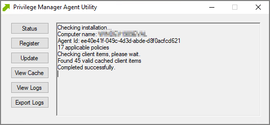
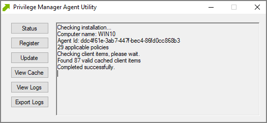
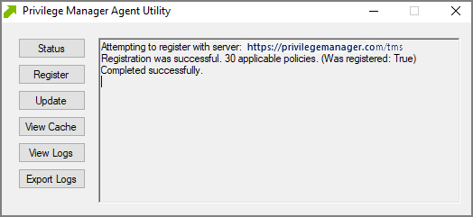
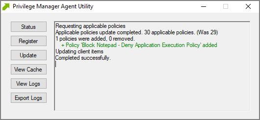
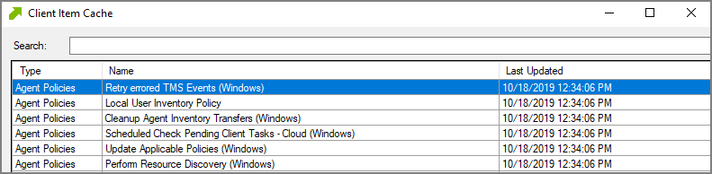
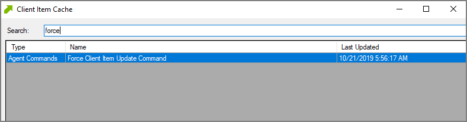
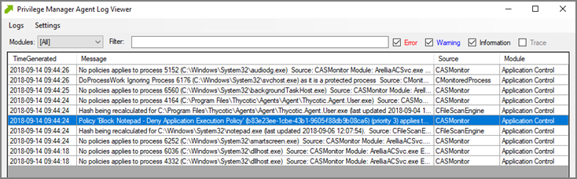

[title]: # (Agent Utility)
[tags]: # (endpoints)
[priority]: # (2)
# Windows Agent Utility

Most endpoint troubleshooting will begin with the agent. There is an Agent Utility that is installed with the agent, used to troubleshoot issues from the endpoint. To open the utility, navigate to the `C:\Program Files\Thycotic\Agents\Agent` folder on the endpoint, and run the __Agent Utility.exe__ application. That will launch the utility, and it will look like the screenshot below.

## Status Button

The Status button will check that the endpoint can communicate with the server and will show you helpful information (such as the Agent ID and how many policies the machine has) and will validate the client items cache. It is also helpful in determining if there are any communication issues between the endpoint and the web server. Below is a screenshot of the information shown after clicking on the Status button.

## Register Button

The Register button will attempt to register the agent machine with the web console. It will show you the URL that the machine is using to communicate with the console. It will also give errors if there are issues with that communication. If you have just installed an agent on the machine, then it will also give information about the install code if there are any errors with that.

## Update Button

The Update button will communicate back to the web server and update any new applicable policies or changes to current policies, filters, actions, etc. the endpoint already has on it.

## View Cache Button

The View Cache button will open the Agent Cache Viewer in a separate window. It displays the Policies, Filters, and Actions the endpoint has cached currently.

Starting with Privilege Manager version 10.7 the Client Item Cache is list also searchable. Enter a search term into the search bar and just review items that contain that term.

## View Logs

Clicking on the View Logs button will open the Agent Log Viewer in a separate window. The screenshot below shows what the log viewer looks like.

## Export Logs Button

Clicking on the Export Logs button will allow you to save the agent logs so that you can send them to someone if needed. They will be saved in the .evtx format so they can be opened with Event Viewer in Windows. Anytime there are issues with policies on endpoints and you need additional assistance, you will need to collect the agent logs first to help with determining what is causing the issue.
