[title]: # (Create Custom Notifications)
[tags]: # (action customization)
[priority]: # (4)
# Create Custom Notifications

The default Application Denied Notification Action can be edited/replaced by a customized notification action to better suite a specific customer need.

Default Notification:

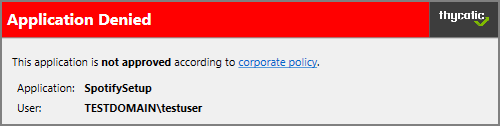

Custom Notification:

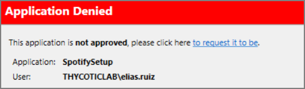

## Enable View as XML

To edit the message text the __View as XML__ button has to be enabled in your console. 

1. Hover (do not click) over your user icon, click __Preferences__.

   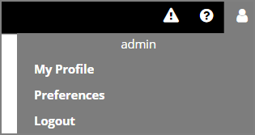
1. Verify the __Show ‘View as XML’ Button__ checkbox is enabled. If the checkbox is not selected, click __Edit__.

   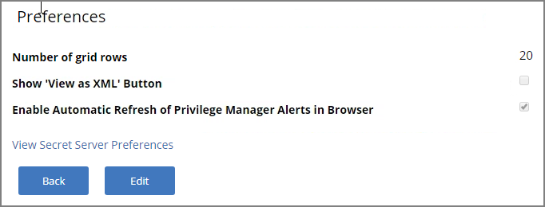
1. Select the checkbox and click __Save__.

## Editing the Application Denied Notification Action

Default Actions shouldn't be edited directly, however Privilege Manager default items can be copied for customization purposes.

1. In the top Search box enter Application Denied Notification Action.

   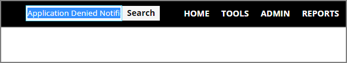

   The search results are displayed.

   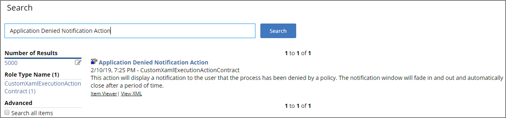
1. Click on the name of the Action __Application Denied Notification Action__.

   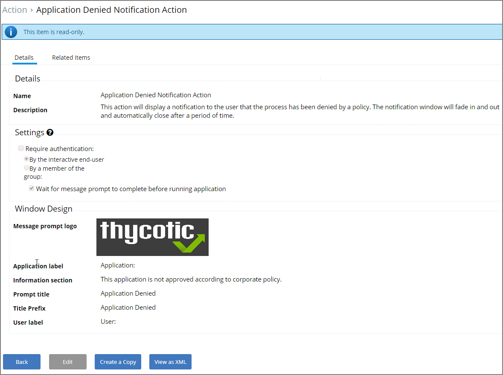
1. Click __Create a Copy__.
1. Enter a customized and meaningful name for the action.

   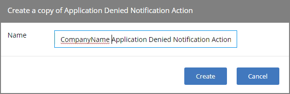
1. Click __Create__. Once you click Create, the new action page opens.

   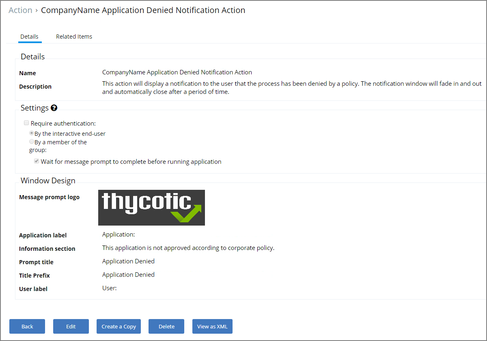
1. To upload a custom image file click __Edit__. You can upload a custom logo, the file size should be under 128 KB and the width should be 500 pixels or less.
1. Click __Choose File__.

   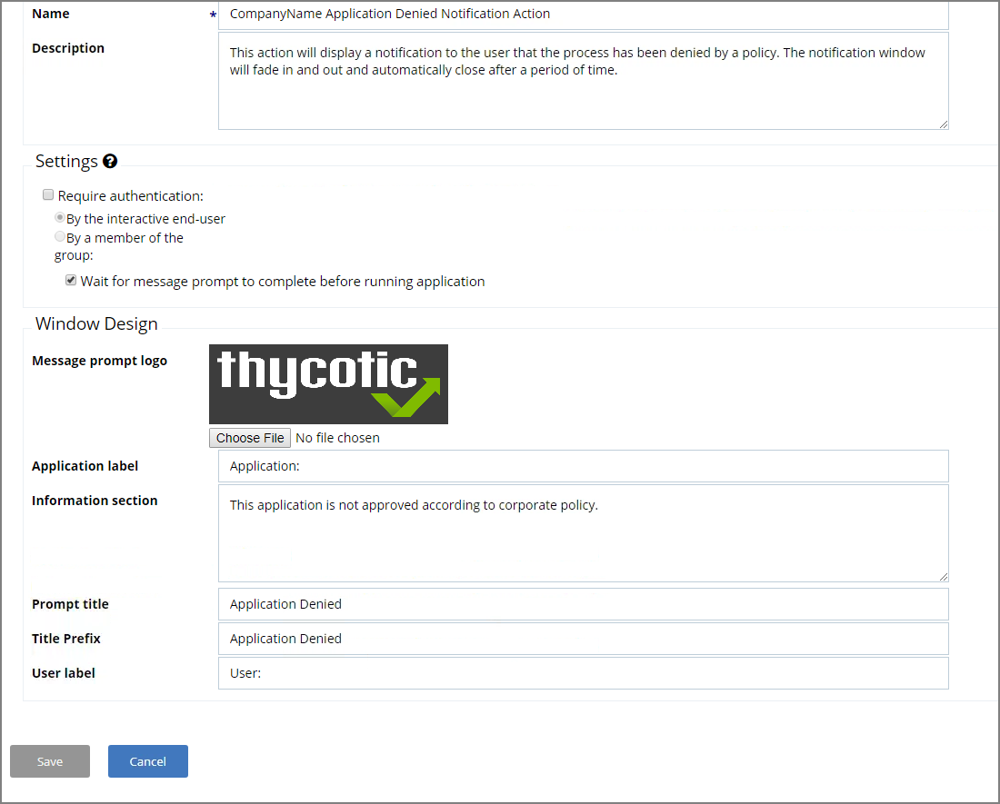
1. Click __Save__.

   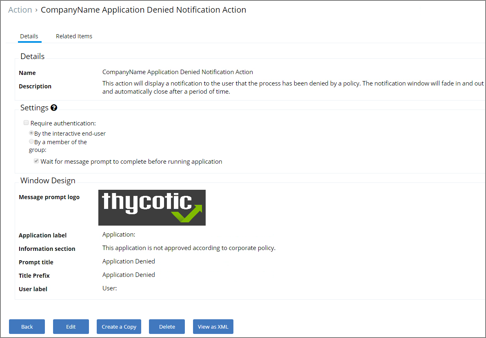
1. Click __View as XML__.

   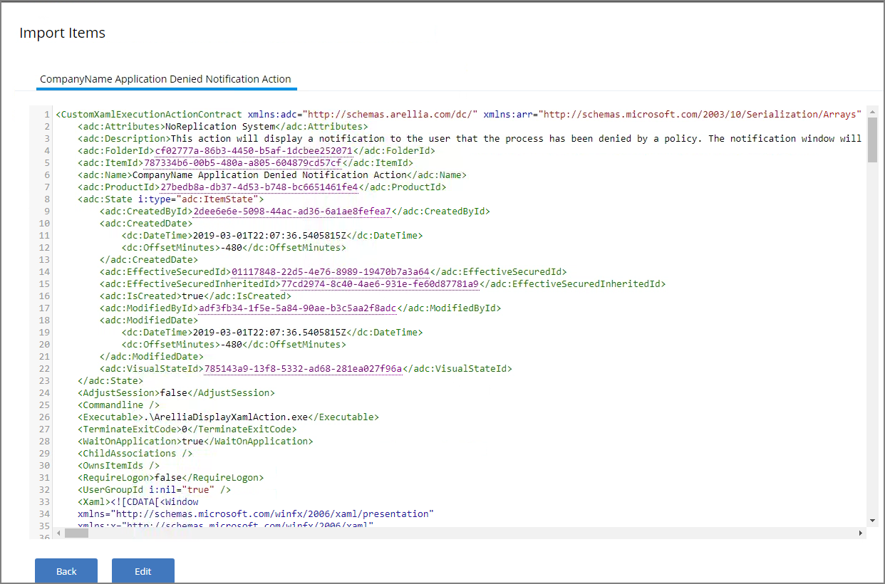
1. Change the notification text in the XML viewer:

   Line 82 has the following:

   ```xml
   <Paragraph><Run>This application is </Run><Bold><Run>not approved</Run></Bold><Run> according to </Run><Hyperlink TargetName="_blank" NavigateUri="http://www.example.com/policy"><Run>corporate policy</Run></Hyperlink><Run>.</Run></Paragraph>
   ```

   Edit this space with the URL and the name of the Hyperlink you would like for your pop up Window.

   ```xml
   <Paragraph><Run>This application is </Run><Bold><Run>not approved.</Run></Bold><Run> please click here, </Run><Hyperlink TargetName="_blank" NavigateUri="http://www.thycotic.com/helpdesk"><Run>to request its approval</Run></Hyperlink><Run>.</Run></Paragraph>
   ```
1. Change the default timeout:

   If you wish to change the default time out for how long the Deny Notification stays up (default is 6 seconds), edit Line 299:

   ```xml
   <i:Interaction.Triggers>
   <i:EventTrigger EventName="Loaded">
   <adx:InvokeCommandWithDelayAction x:Name="CloseAction" Command="{BindingCloseCommand}" Delay="00:00:06" />
   </i:EventTrigger>
   </i:Interaction.Triggers>
   ```

   To change it to 15 seconds, edit this elements delay parameter to 15:

   ```xml
   <adx:InvokeCommandWithDelayAction x:Name="CloseAction" Command="{BindingCloseCommand}" Delay="00:00:15" />
   ```
1. Click __Import__. If you get an error, please address your changes. Errors are indicated with a red dot. Save any edits when resolving errors.

## Updating the Policy with the new Action

After creating a custom notification action, the policy using the default notification needs to be updated.

1. Navigate to __Admin | Policies__ and locate the policy that uses the default Notification.
1. Go to the __Actions__ tab.
1. Click __Edit__.

   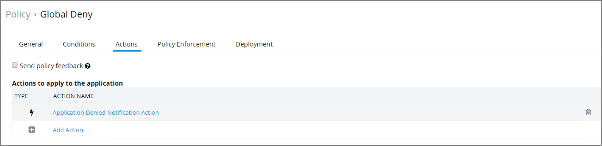
1. To the right of the current default action click the trash can.
1. Click Confirm Remove.

   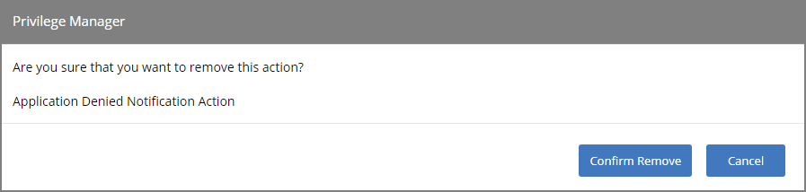
1. Click __Add Action__.

   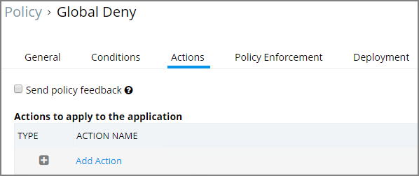
1. Search for the name of your Custom Action. If it does not show up, click the Refresh icon to reload the Actions into the cache.

   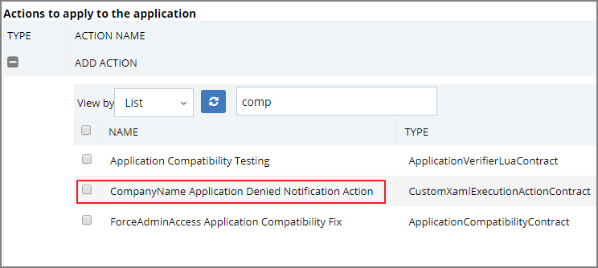
1. Check the box next to the custom action, click Add.

   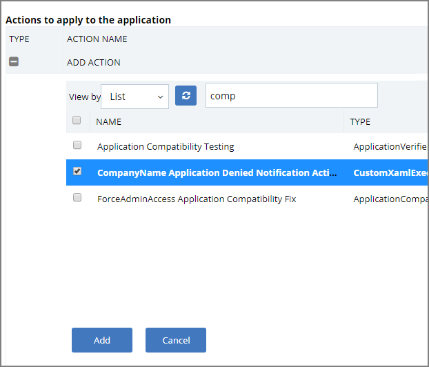
1. Click __Save__.

Policy changes are automatically propagated to the endpoints. Note, that this might not be instantaneous based on the refresh cycle.

### For Privilege Manager Versions Prior to 10.7

If you are on a system version __prior to 10.7__, navigate to the Deployment Tab on the Policy and click __Cache Policy__.

   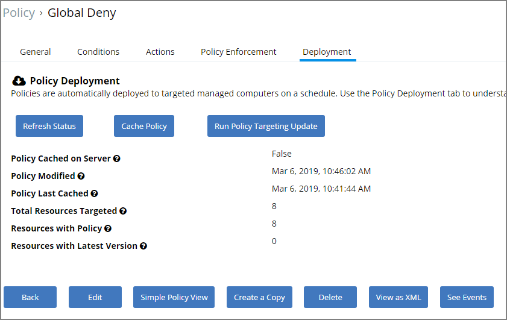

You can then go to your test endpoint and open the __Thycotic Agent Utility__ and click __Update__ to get the new Action on the test endpoint.
