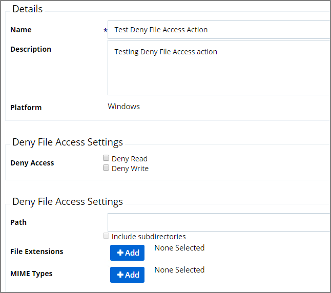

[title]: # (Deny File Access)
[tags]: # (action)
[priority]: # (5)
# Deny File Access Action

As the name suggests, this type of action will prevent applications from reading or writing (or both) to certain directories or to Microsoft Office documents.

## Parameters

The following Deny File Access Settings can be specified:

* Deny Access to read and/or write operations.
* Path and possibly subdirectory locations.
* Specific file extensions.
* MIME types.
