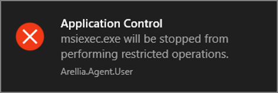

[title]: # (Deny Windows Hooking)
[tags]: # (action)
[priority]: # (5)
# Deny Windows Hooking Action

This type of action will limit specified applications from interacting in malicious ways with other applications.

This action does not have any configurable parameters.

## Windows Hooking Message

The action displays a message to the user informing them that an application will be stopped from interacting with other applications. The Deny Windows Hooking Action should be used with this message.

