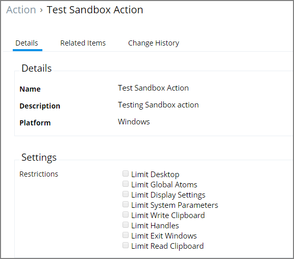
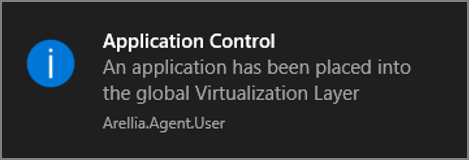
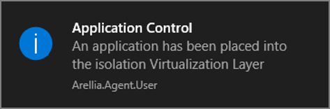
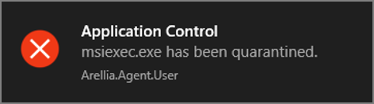

[title]: # (Sandbox)
[tags]: # (action)
[priority]: # (5)
# Sandbox Action

This type of action will limit the environments in which certain code can execute. The sandbox runs a process in a job object that limits its ability to interact with other processes, as well as limiting some specific types of interactions with the operating system.

## SWV Global Layer User Message

This action displays a message to the user informing that an application has been placed in SWV global layer.

## SWV Isolation Layer User Message

This action displays a message to the user informing them that an application has been placed in SWV isolation layer.

## Quarantine Message

This action displays a message to the user informing that an application has been quarantined. The File Quarantine Action should be used with this message.

