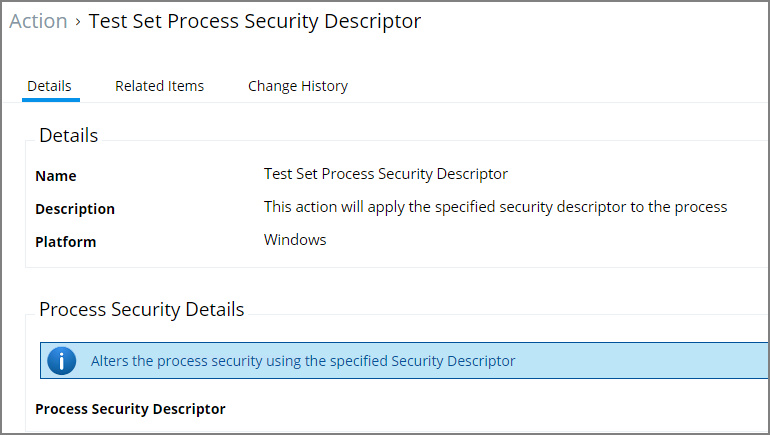

[title]: # (Set Process Security Descriptor)
[tags]: # (action)
[priority]: # (5)
# Set Process Security Descriptor Action

Adjusting Process Security allows a process to be protected from most tampering by users. For example, adjusting process security can restrict who can stop a process from the task manager.

## Parameters

The parameters for the Set Process Security Descriptor action are done via resource selection from a list of available security descriptors.
