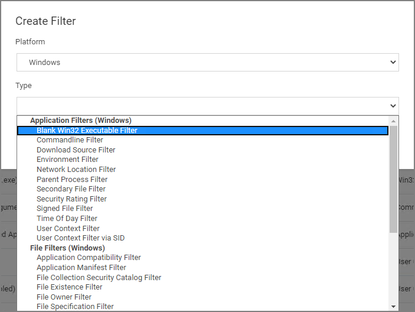

[title]: # (Filters)
[tags]: # (overview)
[priority]: # (2)
# Filters

In Privilege Manager, using a robust filtering system is the key to creating accurate and effective Policies.

A filter is made up of specific criteria that Privilege Manager uses to target important file data (or Events) that occur across your environment. You can think of Filters as the core identifiers in your Privilege Manager system. They are used to identify various levels of activity across your organization's computers, including processes (applications) that are launched on computers, who is executing an application, or the state of the computer that the process is being executed on. 

An Event in Privilege Manager is any piece of file data or executable on a computer that is targeted by a policy.

There are different methods for Filter-creation and usage, but if you take the time to familiarize yourself with our out-of-the-box filters they can help make your policy-creation process easy. This article will provide details and descriptions for Windows Filters in Privilege Manager and how you can begin using out-of-the-box Filters, or create your own.

## Types of Filters

We recommend leveraging Privilege Manager's out-of-the-box filters to get your policies up and running fast! For a complete list of out-of-the-box filters according to category type, review our Filters' Catalog for Privilege Manager here.

You can search your full list of available filters by navigating to __Admin | Filters__ in Privilege Manager. If you already know what you want to target, simply try typing keywords in the search bar to check whether a filter exists that fits your target goal.

>**Note:** If using the default filters provided with Privilege Manager, always verify existing targeting information.

Review the [Filters Catalog for Privilege Manager](default-filters.md) for details about all out-of-the-box filters shipped with the product.

### Create A Copy - How to Use Filter Templates

Out-of-the-Box filters are designed to be used as templates, meaning when you open these filters you will see a __Duplicate__ option rather than the option to immediately Edit. These filter templates are protected to provide a jumping off point whenever creating new filters. They are formed by specific criteria that you can tailor according to your specific use case after copying.

Keep in mind that every filter in Privilege Manager - whether or not it is a template - can be leveraged by the Copying feature.

### Creating a New Filter Manually

The following a basic steps to create a filter. Based on platform and type the end result shown in this example can be different.

1. In the Privilege Manager console, navigate to __Admin | Filters__.
1. Click __Create Filter__.
1. On the __Create Filter__ modal,

   1. select a Platform from the drop-down.

      
   1. select the Type from the drop-down.

      
   1. enter a __Name__ and __Description__.

      
1. Click __Create__.

Once the filter is created, the new filter page open and information under the Details, File Specifications, and File Details sections can be edited. The Save and Cancel buttons appear once you make the first change on the page.

### Creating macOS Filters Manually

In cases when Privilege Manager does not have enough information from the discovery process on a macOS endpoint, filters have to be created manually.

To manually find granular information required for targeting applications in Privilege Manager on a macOS endpoint,

1. Right-click the target application and select __Show Package Contents__.
1. Navigate to __Contents | Info.plist__, this gives you a coded list of items that you can match into the details page of your Filter.  
  
For example, the highlighted section below can be entered into the __Bundled Identifier__ line item when creating a Firefox filter.  

## Creating New Filters using Event Discovery

One way to begin creating new Filters that identify specific files or applications on your network is to set up a Learning Mode Policy and use the events pulled in by Privilege Manager from actions performed on a test machine. See our User Guide's section on Event Discovery for more information on setting up a Learning Mode Policy.

In Privilege Manager, navigate to <!-- TODO: need to change --> Admin | Event Discovery | Files. Under a recognized event, clicking Create Filter should bring you to an Add New Filter page* with the known identifiers needed for targeting this event auto-populated.

*If you are NOT directed to an Add New Filter screen, this means Privilege Manager doesn’t have enough information to target this event yet. In these cases you may need to create Filters manually. See section below for Adding New Filters Manually.

This Add New Filter page reveals the available list of building blocks, attributes, or criteria used for creating a Windows' filter. In other words, the following list of criteria are possible data fields that Privilege Manager can look and sift for on any given event that your policies target for Windows machines. Note that criteria can vary depending on the type of filter you are creating:

* File Name
* Path
* Internal Name
* Original File Name
* File Version
* Product Name
* Product Version
* Company Name
* File Signature (File must be signed by)

You can choose which criteria to use by checking or un-checking any of the filter line-items listed above. If you are new to the filter creation process, we recommend experimenting with these different identifiers in your test environment to ensure that you are using a comprehensive list of identifiers in your filter, enough to target the application or file intended but not too specific that variations to your target will fall through the filter's criteria hooks.
