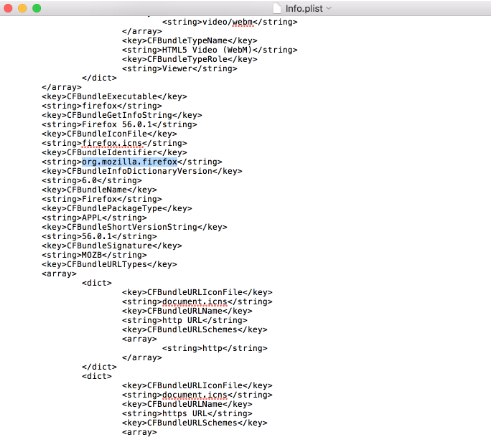

[title]: # (Creating Filters Manually)
[tags]: # (macOS)
[priority]: # (5010)
# Creating Filters Manually

Usually when you navigate to the Files Event Discovery View page (__Admin | Event Discovery | Files__) and click __Create Filter__, you are directed to an __Add New Filter__ screen. If this does not happen, insufficient information is available. In cases when Privilege Manager does not have enough information from the discovery process, filters have to be created manually.

To manually find granular information required for targeting applications in Privilege Manager on a macOS endpoint, 
1. Right-click the target application and select __Show Package Contents__.
1. Navigate to __Contents | Info.plist__, this gives you a coded list of items that you can match into the details page of your Filter.  
  
For example, the highlighted section below can be entered into the __Bundled Identifier__ line item when creating a Firefox filter.  

