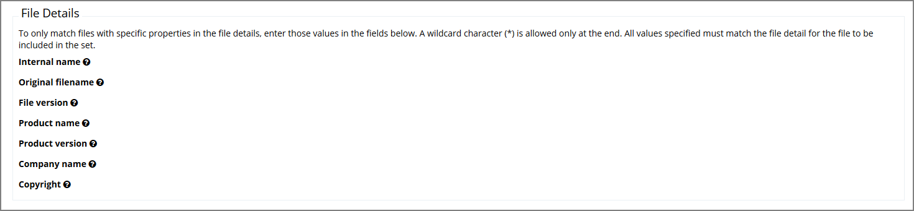
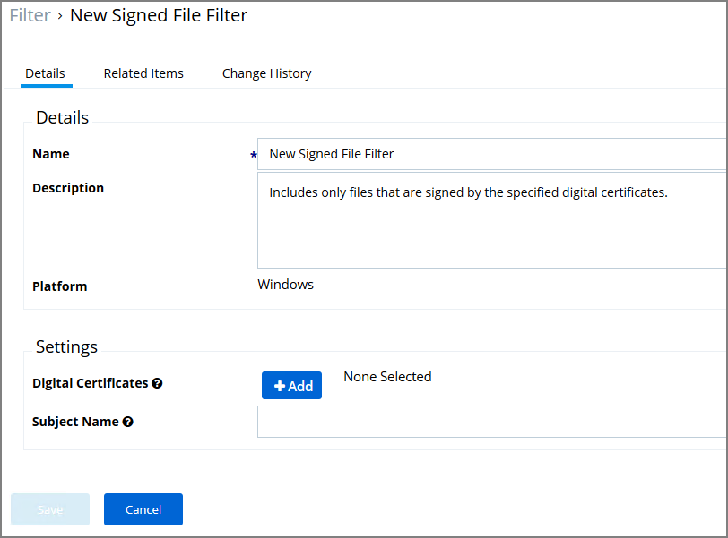

[title]: # (Filter Types)
[tags]: # (description, overview)
[priority]: # (5000)
# Filter Types and Descriptions

There are different types of filters. When creating a new filter for Windows or macOS, the "Filter Type" dropdown gives you a list of options that include the categories:

* Application Filters
* File Filters
* Inventory Filters (__Windows only option__).

These are loose groupings that signify a few different approaches to the filtering method or targets.

### Application Filters

These generally target specific executables or things about the environment. These types of filters can be used to limit policies to a certain time of day, the parent process of an application, the security rating of an application, or the user or group running the process.

* __Blank Win32 Executable Filter__ - Identifies specific application files by 

  * File Specifications, such as

    * File Name
    * File Path with option to include subdirectories
    * First Discovered, which can specified as "Anytime" or "In the last" either Minutes, Hours, Days, or Weeks.

  * File Details (common attributes), such as

    * Internal name
    * Original filename
    * File version
    * Product name
    * Product version
    * Company name
    * Copyright (version 10.7 and up)

      

* __Commandline Filter__ - These filters will perform an exact, partial or regex match on the commandline of the process.

* __Download Source Filter__ - Where is a file being downloaded from? This filter allows you to identify specific download sources, and allows the ability to whitelist sources you trust or block sources you don’t. *No out-of-box filters exist in Privilege Manager for this type*.

* __Environment Variable Filter__ - This type of filter can target environment variables of the process.

* __Network Location Filter__ - This type of filter identifies a computer's connection to specific networks like public, private, or unclassified networks.

* __Parent Process Filter__ - This type of filter can identify parent systems of certain executables.

* __Secondary File Filter__ - Secondary files are not an executable file itself, but another file that is being accessed or used as a command-line parameter for the process such as a script file or MSI installable package.

* __Security Rating Filter__ - If you have integrated Privilege Manager with a Reputation Checking tool like VirusTotal, these filters allow you to look up a rating for a file or application (is it good, bad, suspect/suspicious, or unknown)

* __Signed File Filter__ - This filter allows you to associate one or more Digital Certificate that are trusted and verify that an applications or file is signed by one of those certificates. *No out-of-box filters exist in Privilege Manager for this type*.

  

  Under Settings: 

  * add one or more digital certificates, which are discovered via inventory.
  * enter a Subject Name (version __10.7 and up__). If Subject Name is specified, the digital certificates above will be ignored. The following three match types are supported:

    * The `*` character can be pre- or post- appended to a string to perform a begins with or ends with match (i.e. `Microsoft*`).
    * Lower-case RegEx is also supported and must be surrounded with parenthesis. (i.e. `(micro.*)`)
    * Setting the subject name to `*` will match any file signed with a valid certificate. (__Not recommended by Thycotic__)

* __Time of Day Filter__ - This type of filter exists to create policy parameters for specific timeframes like weekday or weekend hours.

* __User Context Filter__ - This type of filter is used to target users that belong to a specific user group.

### File Filters

These target specific file information. File Filters can be used to target the file owner of the application, the type of file, the application manifest of the file, or whether the application is present in the signed security catalog (Operating System Files).

* __Application Compatibility Filter__ - This type of filter identifies the rights or permissions that an application requires to run.

* __Application Manifest Filter (“Manifest Filter”)__ - Applications that declare specific rights required via a manifest, such as applications that need administrative privileges. 

* __File Collection Security Catalog Filter__ - This is a special collection of files to whitelist or blacklist. This filter type is similar to other Inventory Filters, particularly our Security Catalog Filter. *No out-of-box filters exist in Privilege Manager for this type*.

* __File Existence Filter__ - This type of filter identifies whether a file exists. *No out-of-box filters exist in Privilege Manager for this type*.

* __File Owner Filter__ - This filter identifies files based on ownership.

* __File Specification Filter__ - This filter identifies files based on their file path, or location on a computer.

* __File Type Filter__ - This filter identifies files based on what type of file it is. *No out-of-box filters exist in Privilege Manager for this type*.

* __Internet Zone Filter__ - This filter identifies what internet zone a computer is connected to on your network, such as Trusted Sites and Local Intranet. *No out-of-box filters exist in Privilege Manager for this type*.

* __Security Catalog Filter__ - This is a special collection of files to whitelist or blacklist. For example, the Microsoft Security Catalog is often whitelisted as a trusted catalog.

### Inventory Filters

These depend on file inventory data, meaning they generally apply to already discovered applications or files pulled in by Privilege Manager tasks. For example, after running an inventory task on a specific computer or group of computers, Privilege Manager can glean through the list of file inventory that is reported and target those files. *No out-of-box filters exist in Privilege Manager for this type of filter category*.

* __File Collection from List of Sha1 Hashes Filter__ - This type of filter identifies file inventory based on Secure Hash Algorithms. *No out-of-box filters exist in Privilege Manager for this type*.

* __File Scan Results Filter (Computer)__ - This type of filter identifies file inventory based on another computer's file scan results. This allows for one computer that has been setup properly to be used as a source for this filter. *No out-of-box filters exist in Privilege Manager for this type*.

* __File Scan Results Filter (Policy)__ - This type of filter identifies file inventory based on Privilege Manager Policies. *No out-of-box filters exist in Privilege Manager for this type*.

* __MSI File Contents Filter__ - This type of filter identifies file inventory based on .MSI file contents, i.e. specific Windows package installers. *No out-of-box filters exist in Privilege Manager for this type*..

* __Package Contents Filter__ - This type of filter identifies file inventory based on package contents. *No out-of-box filters exist in Privilege Manager for this type*.

* __Security Catalog Contents Filter__ - This is a special collection of files to whitelist or blacklist. This filter type is similar to other Inventory Filters, particularly our Security Catalog Filter. *No out-of-box filters exist in Privilege Manager for this type*.

* __Virtual Disk File Contents Filter__ -  *No out-of-box filters exist in Privilege Manager for this type*.

* __Virtual Disk Package Contents Filter__ -  *No out-of-box filters exist in Privilege Manager for this type*.

### macOS Specific Filters

* __App Bundle Filter__ - This type of filter identifies app bundles for MacOS machines.

* __Mach-O Header Filter__ - This type of filter identifies files based on their Mach-O file header details that declare it as a specific type of executable such as daemon, device driver, etc. 
