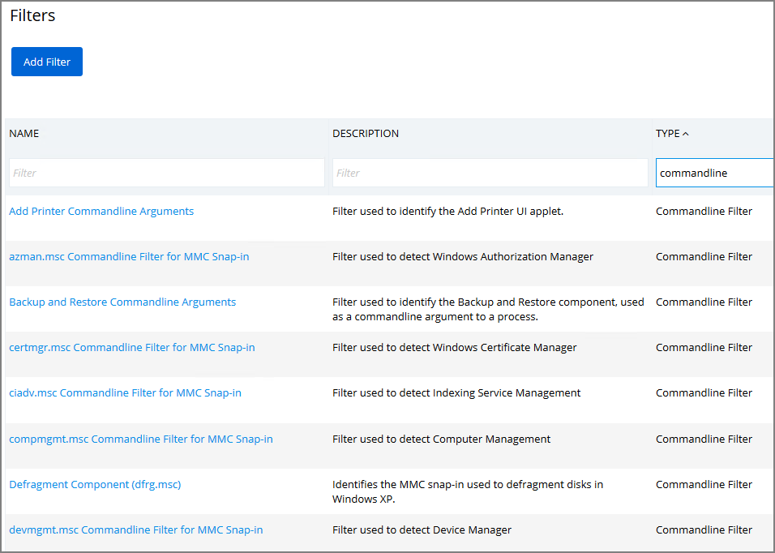
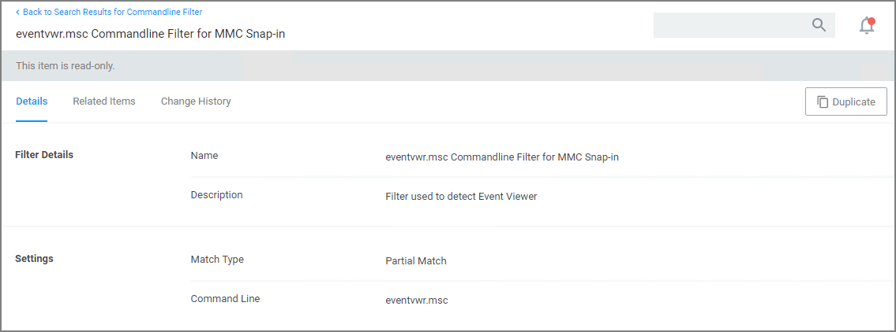
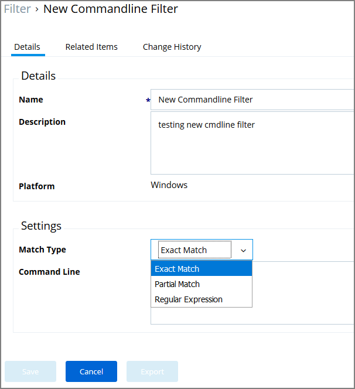

[title]: # (Commandline Filter)
[tags]: # (filter types)
[priority]: # (2)
# Commandline Filter

These filters will perform an exact, partial or regex match on the commandline of the process. Privilege Manager comes with default commandline filter types, which are all read-only, but can be copied to be customized.

## Search for Commandline Filters

1. Navigate to __Admin | More...__ and select __Filters__.
1. In the search field for the __Type__ column enter commandline.

   
1. Select a filter to view its details and/or create a copy to customize the filter.

   

## Create a new Commandline Type Filter

1. Navigate to __Admin | More...__ and select __Filters__.
1. Click __Add Filter__.
1. On the New Filter page, select the platform. For this example, select __Windows__.
1. From the __Filter Type__ drop-down select __Commandline Filter__.
1. Enter a name and description and click __Create__.
1. Click Edit on the newly created filter page to customize.

   
1. Click __Save__.

## Parameters

Commandline Filters have one section to set the parameters for the filter.

The __Match Type__ gives you the options:

* Exact Match
* Partial Match
* Regular expression

__Command Line__:

* This is the section where you would enter in the given command parameters to pull up the file or action.

## Examples

A commandline filter examines the commandline (excluding the primary executable) and applies a pattern match (Exact, Partial or Regular Expression).

For example allowing /FlushDNS as a command for IPConfig.
