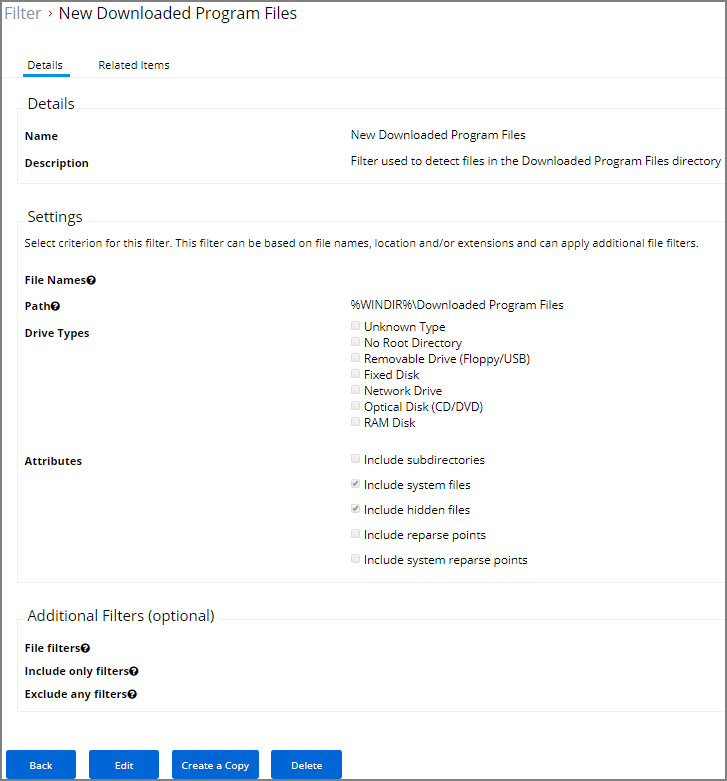

[title]: # (Download Source Filter)
[tags]: # (filter types)
[priority]: # (2)
# Download Source Filter

Where is a file being downloaded from? This filter allows you to identify specific download sources, and allows the ability to whitelist sources you trust or block sources you don’t. *No out-of-box filters exist in Privilege Manager for this type*.

## Parameters

## Examples
