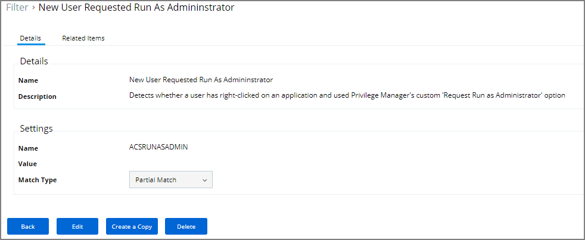
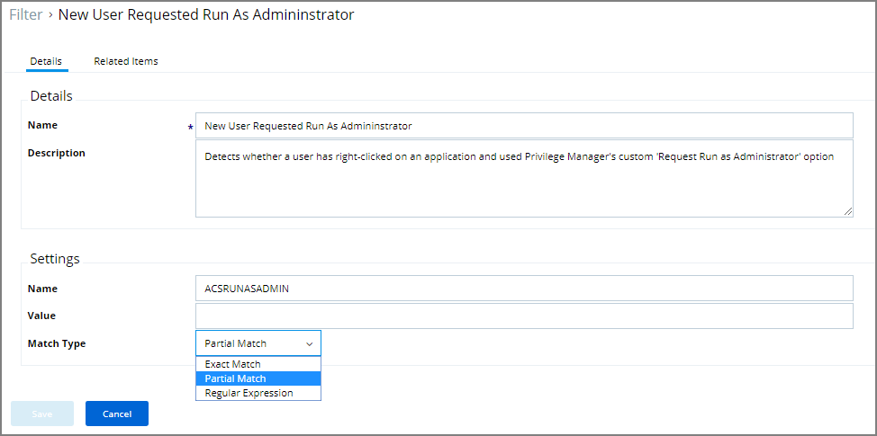

[title]: # (Environment Variable Filter)
[tags]: # (filter types)
[priority]: # (2)
# Environment Variable Filter 

This type of filter can target environment variables of the process.

## Parameters

* Name 
* Value 
* Match Type

## Examples

This type of environment variable filter detects whether a user has right clicked on an application and used Privilege Manager's custom 'Request Run as Administrator' option.
