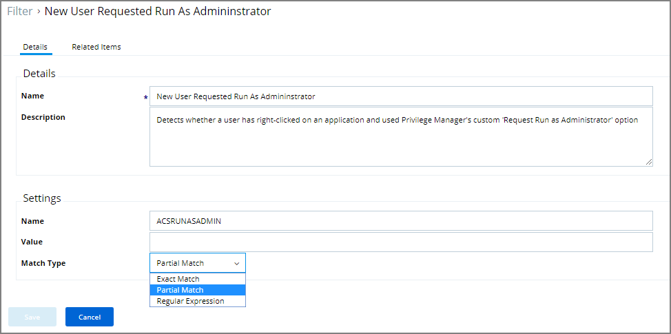

[title]: # (Environment Variable Filter)
[tags]: # (filter types)
[priority]: # (2)
# Environment Variable Filter 

This type of filter can target environment variables of a process that is started.

## Parameters

* Name
* Value
* Match Type

## Examples

A environment variable filter type detects whether a user has right clicked on an application and used Privilege Manager's custom _Request Run as Administrator_ option.
