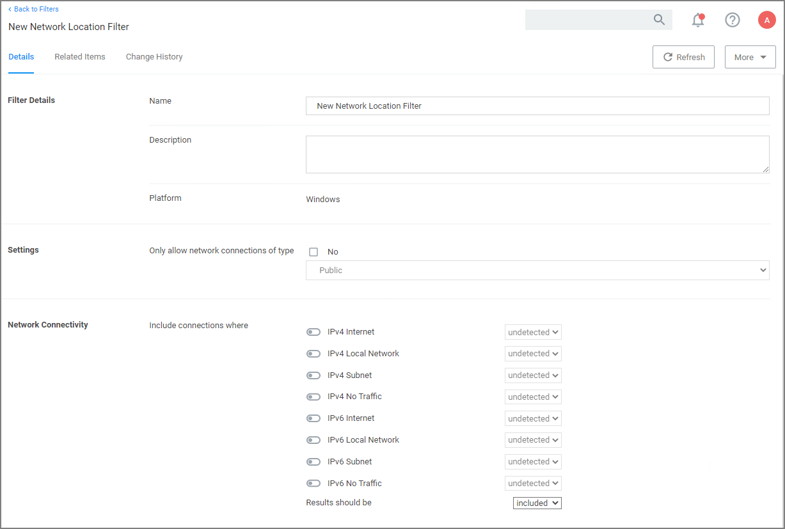

[title]: # (Network Location)
[tags]: # (filter types)
[priority]: # (2)
# Network Location Filter 

This type of filter identifies a computer's connection to specific networks like public, private, or unclassified networks.

## Parameters

You can adjust the following setting options for Network Location filters:

* __Only allow network connections of type__:

  * Public
  * Private
  * Domain

* __Network Connectivity__:

  * IPv4 and IPv6 options for connectivity

* __Results should be__:

  * Included or excluded

## Examples

Some examples of this filter can be set to detect:

* when the computer is not attached to a network
* when the computer is attached to a network classified as public
* when the computer is attached to a network classified as domain
