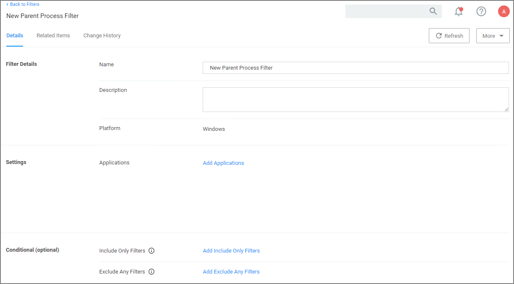

[title]: # (Parent Process Filter)
[tags]: # (filter types)
[priority]: # (2)
# Parent Process Filter

This type of filter can identify parent systems of certain executables.

## Parameters

* Applications
* Conditions 
* Include only filters
* Exclude only filters

## Examples

This filter is used to detect when a user attempts to copy a file using the Privilege Manager copy helper.
