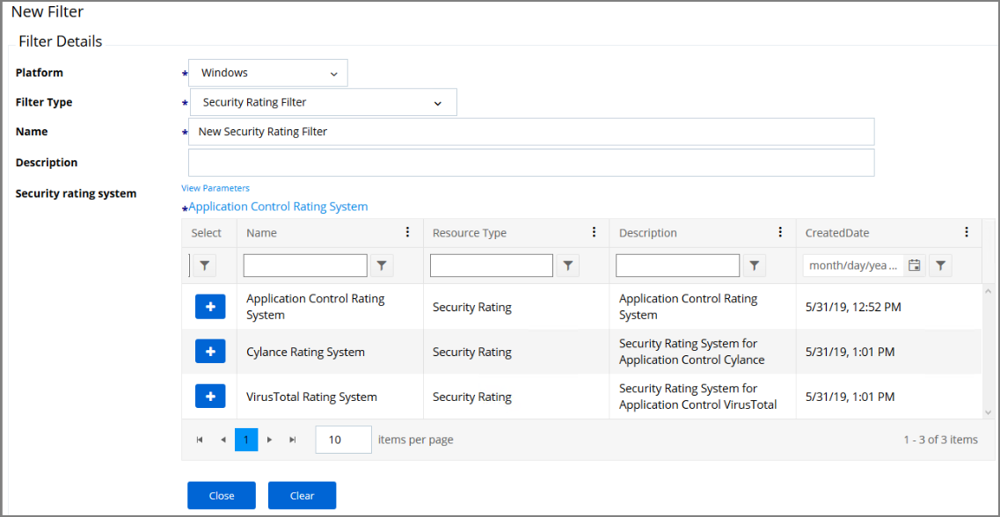
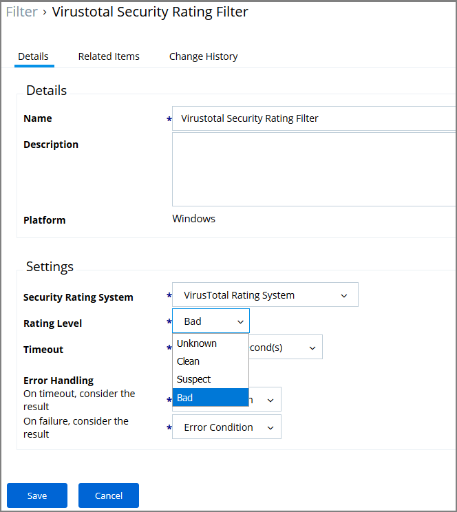

[title]: # (Security Ratings Filter)
[tags]: # (filter types)
[priority]: # (2)
# Security Rating Filter

If you have integrated Privilege Manager with a Reputation Checking provider like VirusTotal, these filters allow you to look up a rating for a file or application (is it good, bad, suspect/suspicious, or unknown).

This filter is available for both Windows and macOS systems.

## Parameters

The parameters for the Security Rating Filter would include the following:

* Security Rating System  
* Rating level
* Timeout
* Error Handling
  * On timeout, consider the result
  * On Failure, consider the result

## Examples

The example above displays how to create a security rating filter after integrating Privilege Manager with VirusTotal.
