[title]: # (Batch File)
[tags]: # (secondary file filter)
[priority]: # (2)
# Batch File Example

## Creating the File Filter for .bat Files

In this example we are creating a filter for the target executing .bat files.

1. In the Privilege Manager Console navigate to __Admin | Filters__.
1. On the Filter page click __Create Filter__.
1. On the __Create Filter__ modal select the platform. This can be either __Both Windows / Mac OS__, __Windows__, or __Mac OS__. For this example, select __Windows__.
1. From the Type drop-down select __Blank Win32 Executable Filter__. This also allows you to link in hashes or signatures.
1. Enter the name and a description for the filter, for example _test.bat_ and _filter for batch files_.

   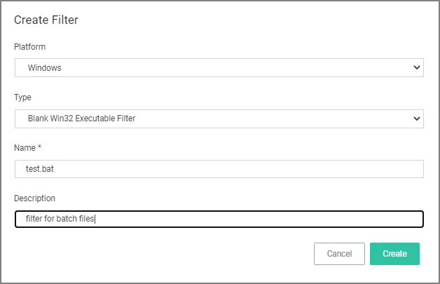
1. Click __Create__.
1. Under Settings for __File Name__ enter either a single file name, file specification, or RegEx.

   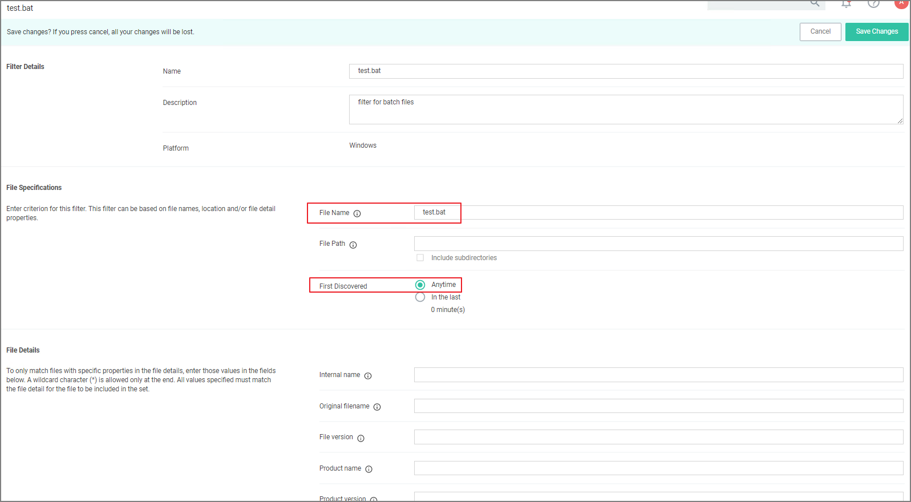

   For this example, we use __test.bat__ to police a single file name.

1. Verify that First Discovered is set to __Anytime__ (default).
1. Click __Save Changes__.

### Creating the Secondary Filter

In this example we are creating the secondary file filter.

1. In the Privilege Manager Console navigate to __Admin | Filters__.
1. On the Filter page click __Create Filter__.
1. On the __Create Filter__ modal select the platform. This can be either __Both Windows / Mac OS__, __Windows__, or __Mac OS__. For this example, select __Windows__.
1. From the Type drop-down select __Secondary File Filter__. 
1. Enter the name and a description for the filter, for example _secondary file filter for batch files_.

   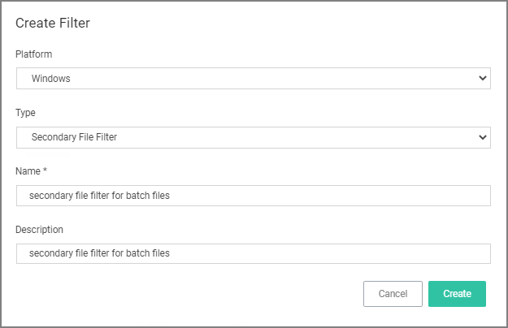
1. Click __Create__.
1. Under Settings click __Add Filters__.

   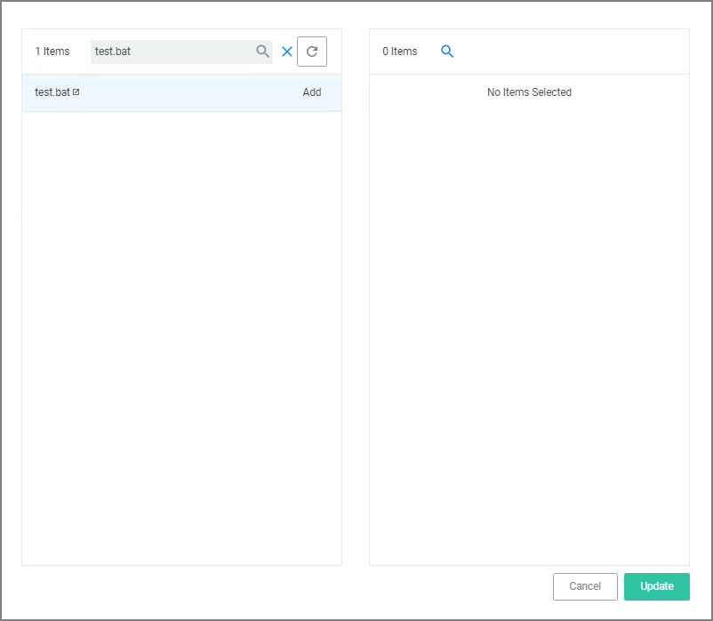
1. Search for __test.bat__, as created in _Creating the File Filter for .bat Files_ procedure above.
1. Click __Add__.

   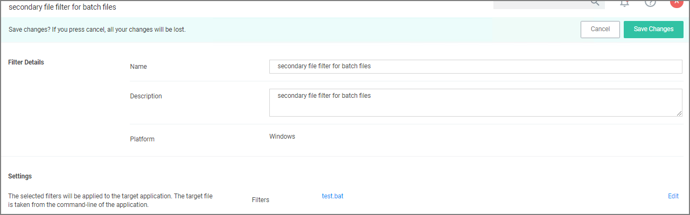
1. Click __Update__.
1. Click __Save Changes__.

### Creating the Policy

1. Navigate to __Computer Groups | Windows Computers__.
1. Select __Application Policies__.
1. Click __Create Policy__.
1. In the policy wizard select __Controlling__, click __Next Step__.
1. In the policy wizard select __Block__, click __Next Step__.
1. In the policy wizard select __Notify and Block__, click __Next Step__.
1. In the policy wizard select __Executable__, click __Next Step__.
1. In the policy wizard select __Existing Filter__, click __Next Step__.
1. Here we are searching for 2 different files and add those to the policy at the same time:
   1. In the modal search field type "secondary file filter" and __Add__ the secondary file filter you created in the previous procedure.
   1. Search for "Command Processor" and __Add__ the Command Processor (cmd.exe).

   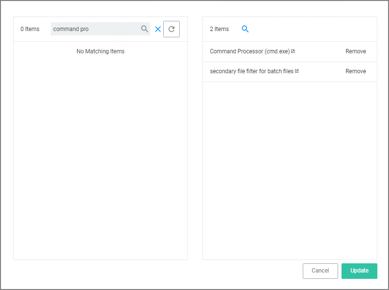
1. Click __Update__.

   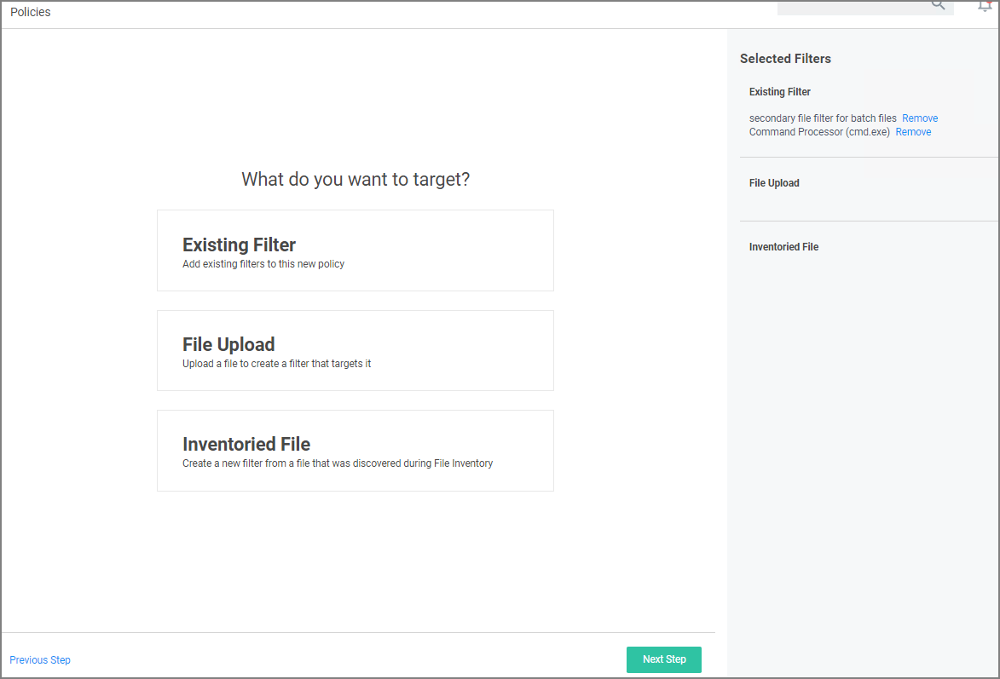
1. Click __Next Step__.

   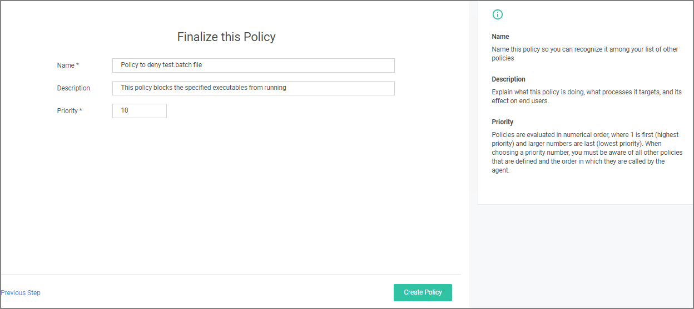
1. Enter a name and customize the description to finalize the policy.
1. Click __Create Policy__.

   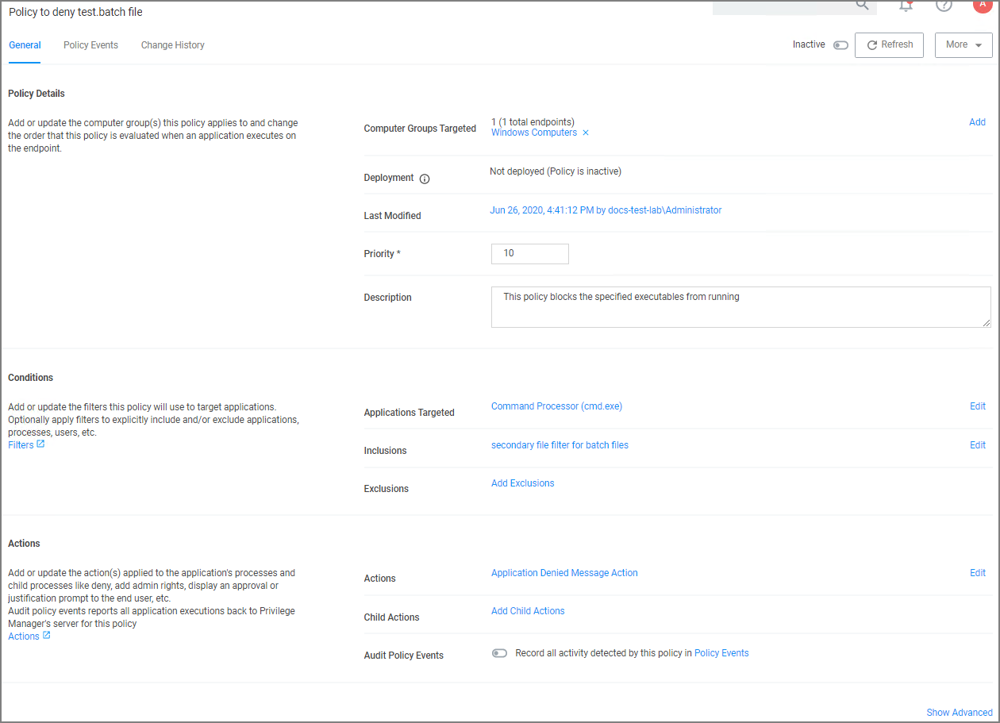

Once the policy is created, it can be customized. 

* The policy is inactive and to activate it, the switch needs to be set to active.

  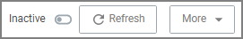 - 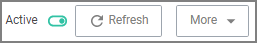
* Computer Groups Targeted can be edited by either 
  * deleting the current target by clicking the __x__ next to the computer group name, or
  * adding another computer group by clicking __Add__. 
* Click the explanation point next to Deployment to run the __Resource and Collection Targeting Update Task__.
* Modify the priority if needed, specific deny policy get lower priority values than monitor, allow, or elevate policies.
* Under Conditions edit the Applications Targeted, the Inclusion, and Exclusion Filters. 
* Under Actions edit the which message action to use, if child actions are applicaple, and if you wish to audit all activies this policy is detecting.
* Clicking __Show Advanced__, provides access to setting Policy Enforcement options, like:
  * Continue Enforcing
  * Applies to All Processes
  * Enforce Child Processes
  * Stage 2 Processing
  * Skip Policy Analysis at Start-up. 