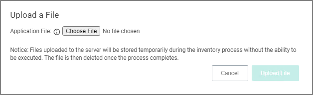
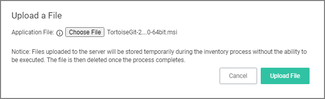
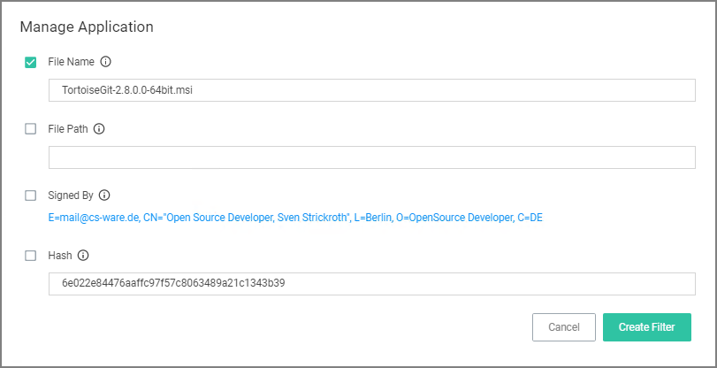
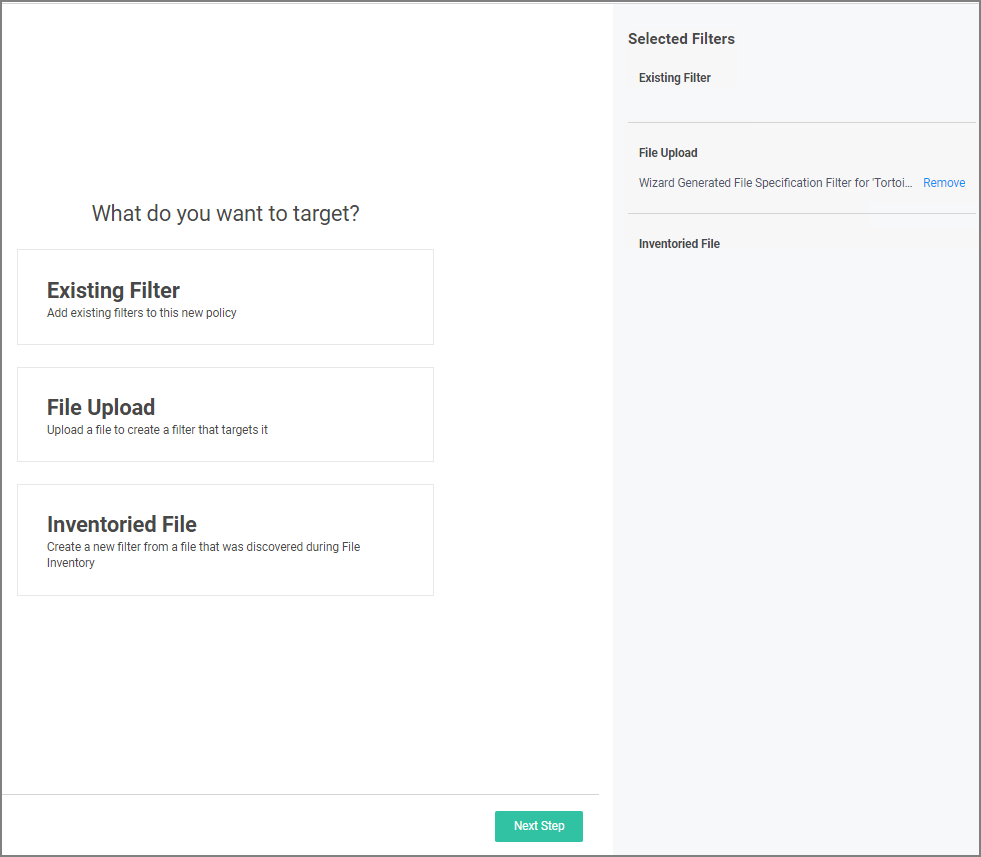
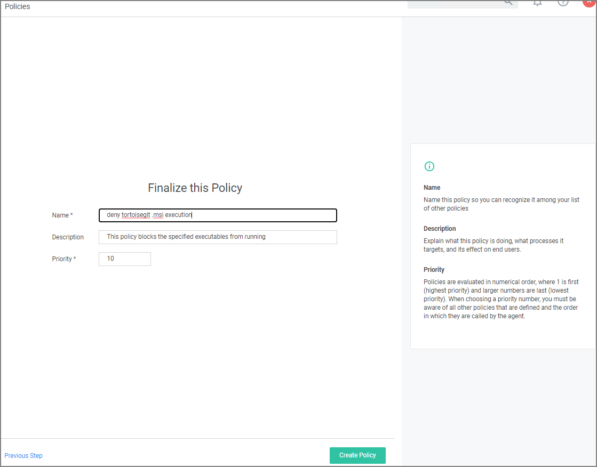
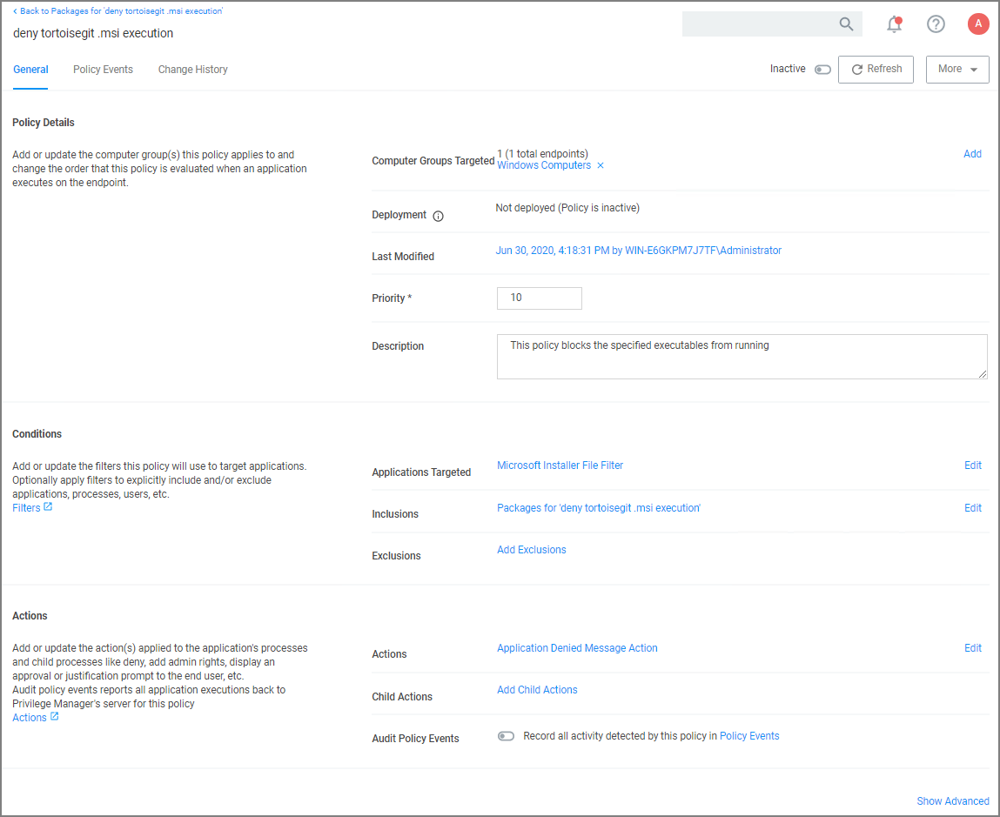

[title]: # (Executable Example)
[tags]: # (secondary file filter)
[priority]: # (2)
# Executables File Example

In this example we are creating a policy to deny running .msi files.

## Creating the Policy

1. Navigate to __Computer Groups | Windows Computers__.
1. Select __Application Policies__.
1. Click __Create Policy__.
1. In the policy wizard select __Controlling__, click __Next Step__.
1. In the policy wizard select __Block__, click __Next Step__.
1. In the policy wizard select __Notify and Block__, click __Next Step__.
1. In the policy wizard select __Installer Packages__, click __Next Step__.
1. In the policy wizard select __File Upload__.
   1. On the Upload a File modal, Click __Choose File__.

      
   1. Select the file(s) you wish to be targeted. For this example we are selecting a TortoiseGit installer package.

      
   1. Click __Upload File__.
   1. On the Manage Application dialog, check __File Name__.

      

      Select more details like the File Path or the Hash, if you want to make this policy more specific.
   1. Click __Create Filter__.

      
   1. Click __Next Step__.
1. On the Finalize the Policy page, enter a name for your new policy. The policy will be created with a default priority of 10, since it is a deny and notify policy.

   
1. Click __Create Policy__.

   

The policy wizard added based on the selected file upload and the file inventory that was executed and application target of Microsoft Installer Files.

A secondary file filter was added under Inclusions, identifying a specific file filter for the tortoisegit.msi execution.
