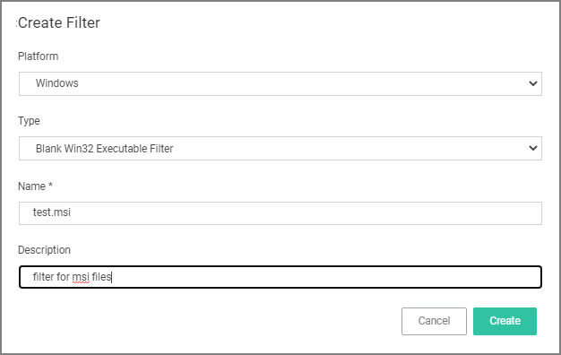
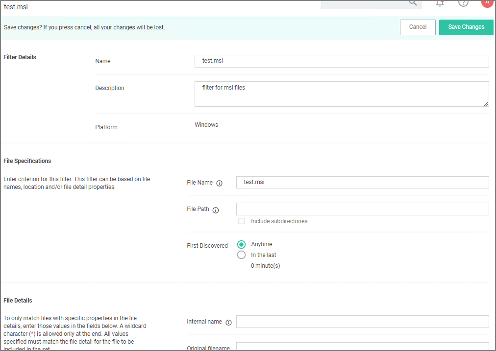
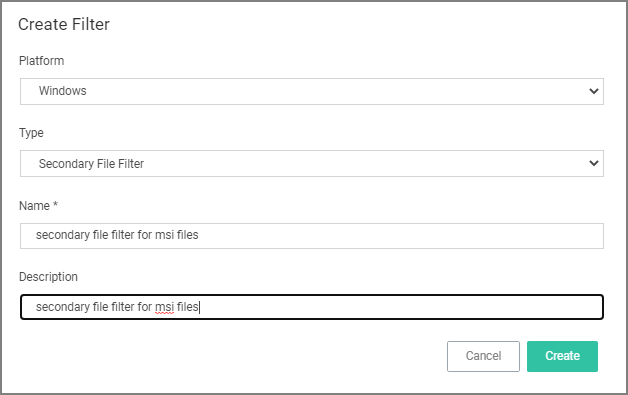
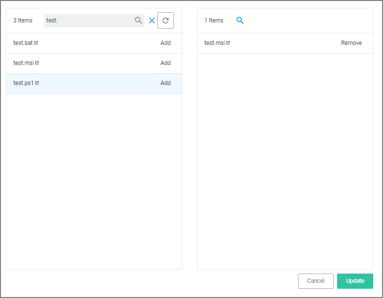
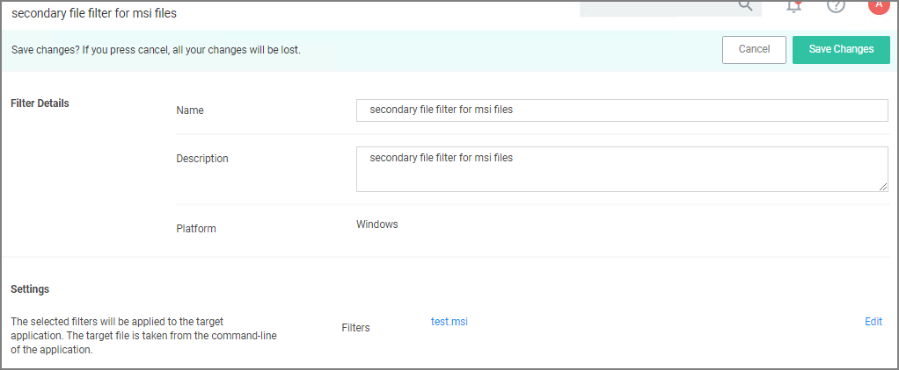
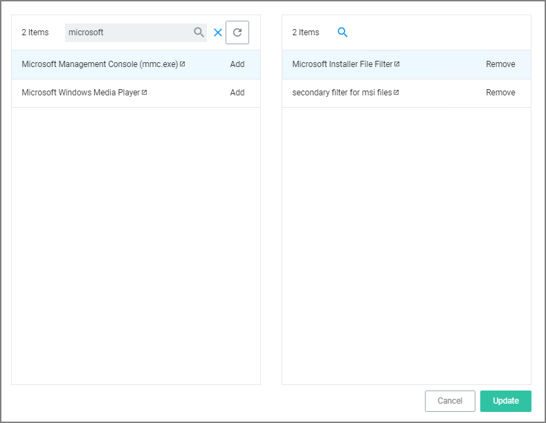
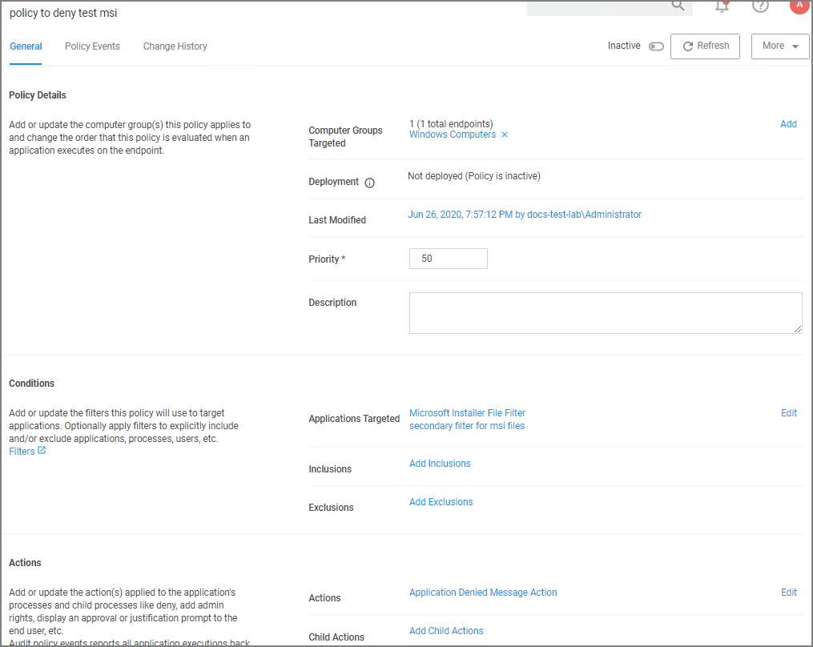

[title]: # (Batch File)
[tags]: # (secondary file filter)
[priority]: # (2)
# MSI File Example

In this example we are creating a policy to deny running a test.msi file.

## Creating the File Filter for .msi Files

In this example we are creating a filter for the target executing .msi files.

1. In the Privilege Manager Console navigate to __Admin | Filters__.
1. On the Filter page click __Create Filter__.
1. On the __Create Filter__ modal select the platform. This can be either __Both Windows / Mac OS__, __Windows__, or __Mac OS__. For this example, select __Windows__.
1. From the Type drop-down select __Blank Win32 Executable Filter__. This also allows you to link in hashes or signatures.
1. Enter the name and a description for the filter, for example _test.msi_ and _filter for msi files_.

   
1. Click __Create__.
1. Under Settings for __File Name__ enter either a single file name, file specification, or RegEx.

   

   For this example, we use __test.msi__ to police a single file name.

1. Verify that First Discovered is set to __Anytime__ (default).
1. Click __Save Changes__.

## Creating the Secondary Filter

In this example we are creating the secondary file filter.

1. In the Privilege Manager Console navigate to __Admin | Filters__.
1. On the Filter page click __Create Filter__.
1. On the __Create Filter__ modal select the platform. This can be either __Both Windows / Mac OS__, __Windows__, or __Mac OS__. For this example, select __Windows__.
1. From the Type drop-down select __Secondary File Filter__. 
1. Enter the name and a description for the filter, for example _secondary file filter for msi files_.

   
1. Click __Create__.
1. Under Settings click __Add Filters__.

   
1. Search for __test.bat__, as created in _Creating the File Filter for .bat Files_ procedure above.
1. Click __Add__.

   
1. Click __Update__.
1. Click __Save Changes__.

## Creating the Policy

1. Navigate to __Computer Groups | Windows Computers__.
1. Select __Application Policies__.
1. Click __Create Policy__.
1. In the policy wizard select __Controlling__, click __Next Step__.
1. In the policy wizard select __Block__, click __Next Step__.
1. In the policy wizard select __Notify and Block__, click __Next Step__.
1. In the policy wizard select __Executable__, click __Next Step__.
1. In the policy wizard select __Existing Filter__, click __Next Step__.
1. Here we are searching for 2 different files to add those to the policy at the same time:
   1. In the modal search field type "secondary file filter" and __Add__ the secondary file filter you created in the previous procedure.
   1. Search for "microsoft" and __Add__ the Microsoft Installer File Filter filter.

   
1. Click __Update__.
1. Click __Next Step__.
1. Enter a name and customize the description to finalize the policy.
1. Click __Create Policy__.

   

Once the policy is created, it can be [customized](../../../../policies/policy-page.md).
