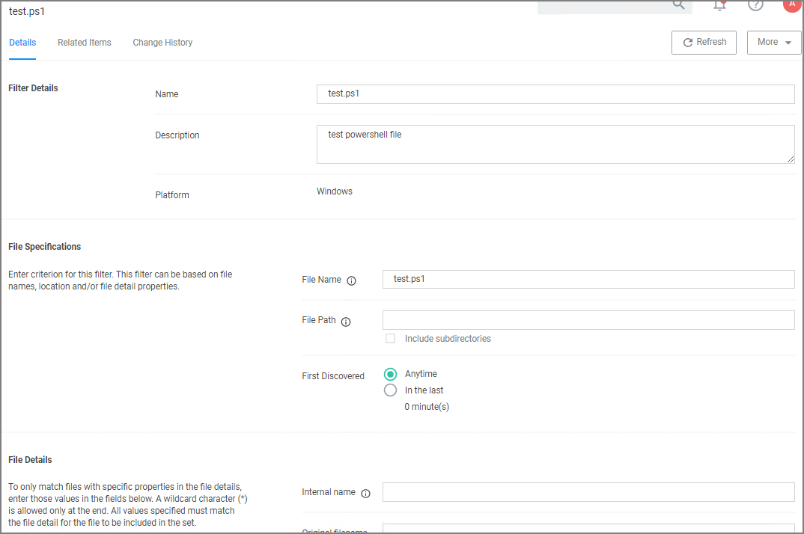
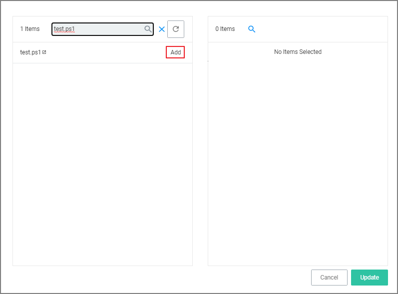
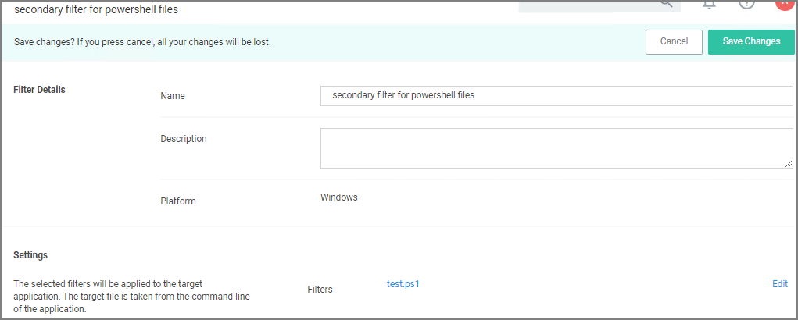
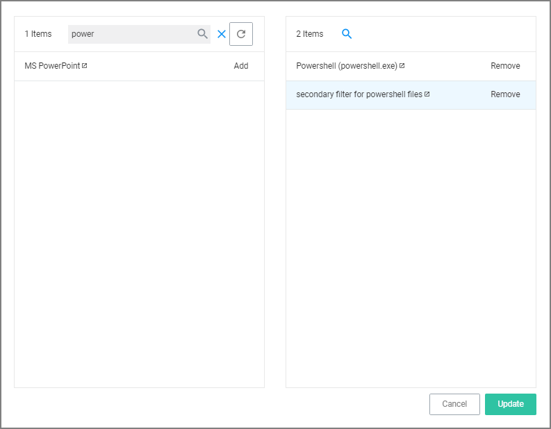
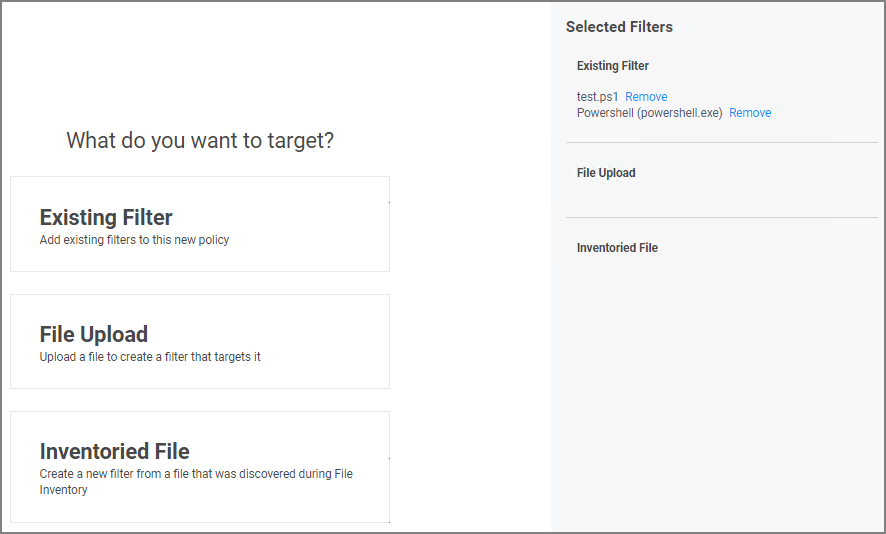
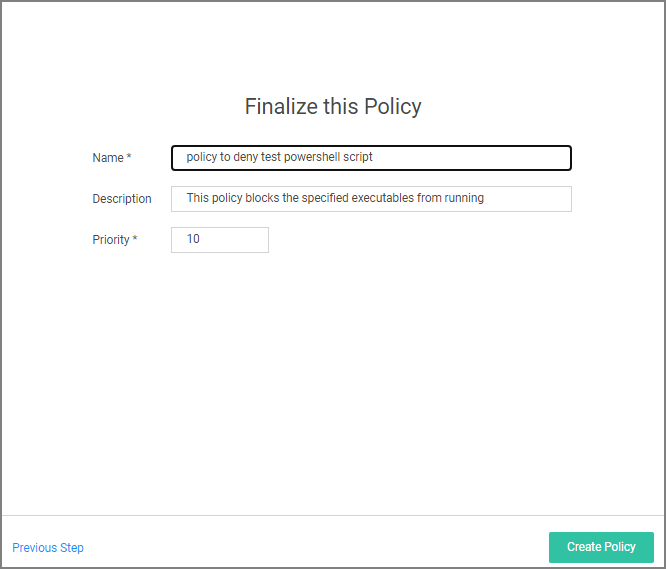
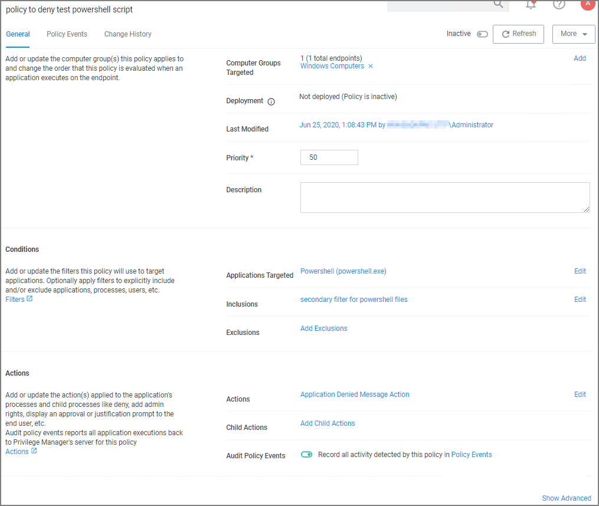
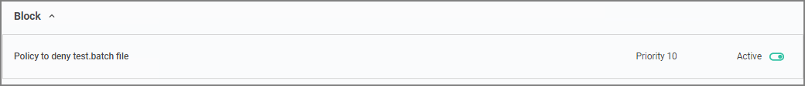
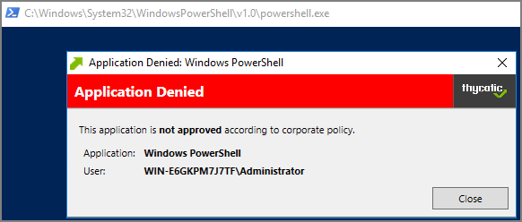
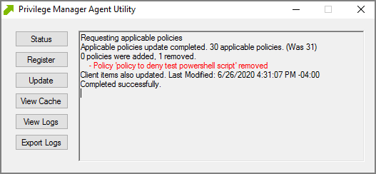

[title]: # (PowerShell File)
[tags]: # (secondary file filter)
[priority]: # (2)
# PowerShell Script Example

In this example we are creating a policy to deny running a test.ps1 file.

## Creating the File Filter for .ps1 Files

In this example we are creating a filter for the target executing .ps1 files.

1. In the Privilege Manager Console navigate to __Admin | Filters__.
1. On the Filter page click __Create Filter__.
1. On the __Create Filter__ modal select the platform. This can be either __Both Windows / Mac OS__, __Windows__, or __Mac OS__. For this example, select __Windows__.
1. From the Type drop-down select __Blank Win32 Executable Filter__. This also allows you to link in hashes or signatures.
1. Enter the name and a description for the filter, for example _test.ps1_ and _filter for powershell files_.
1. Under Settings for __File Name__ enter either a single file name, file specification, or RegEx.

   

   For this example, we use __test.ps1__ to police a single file name.

1. Verify that First Discovered is set to __Anytime__ (default).
1. Click __Save Changes__.

## Creating the Secondary Filter

In this example we are creating the secondary file filter.

1. In the Privilege Manager Console navigate to __Admin | Filters__.
1. On the Filter page click __Create Filter__.
1. On the __Create Filter__ modal select the platform. This can be either __Both Windows / Mac OS__, __Windows__, or __Mac OS__. For this example, select __Windows__.
1. From the Type drop-down select __Secondary File Filter__. 
1. Enter the name and a description for the filter, for example _secondary file filter for powershell files_.
1. Click __Create__.
1. Under Settings click __Add Filters__.

   
1. Search for __test.ps1__, as created in _Creating the File Filter for .bat Files_ procedure above.
1. Click __Add__.

   
1. Click __Update__.
1. Click __Save Changes__.

## Creating the Policy

1. Navigate to __Computer Groups | Windows Computers__.
1. Select __Application Policies__.
1. Click __Create Policy__.
1. In the policy wizard select __Controlling__, click __Next Step__.
1. In the policy wizard select __Block__, click __Next Step__.
1. In the policy wizard select __Notify and Block__, click __Next Step__.
1. In the policy wizard select __Executable__, click __Next Step__.
1. In the policy wizard select __Existing Filter__, click __Next Step__.
1. Here we are searching for 2 different files to add those to the policy at the same time:
   1. In the modal search field type "secondary file filter" and __Add__ the secondary file filter you created in the previous procedure.
   1. Search for "power" and __Add__ the Powershell (powershell.exe) filter.

   
1. Click __Update__.

   
1. Click __Next Step__.

   
1. Enter a name and customize the description to finalize the policy.
1. Click __Create Policy__.

   

Once the policy is created, it can be [customized](../../../../policies/policy-page.md).

## Verifying the Policy Works

1. Add a test.bat file with a simple Hello World command to your system.
   1. Create a new text file and add
   
      ```powershell
       Write-Host "Hello, World!"
      ```
   1. Save the file as test.ps1.
1. With your policy set to __active__, double-click the test.ps1 file.

   

   The policy triggers the specified message action:

   
<!-- 1. With your policy set to __inactive__, verify via Agent Utility that the update was received and the policy was removed:

   
1. Double-click the test.ps1 file.

   

   The PowerShell file is executed and Hello World is printed to the cmd.exe output window. -->
