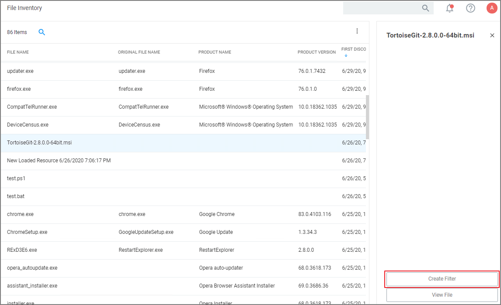
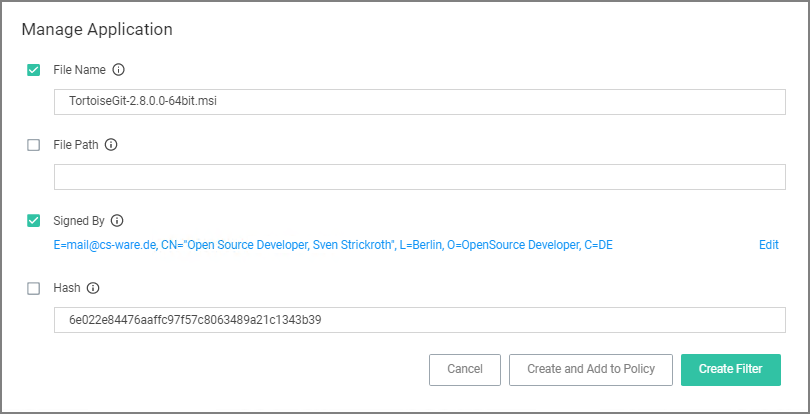
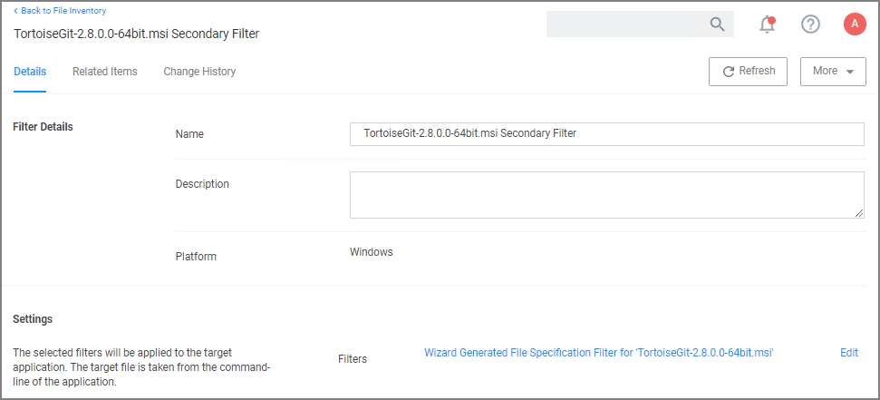
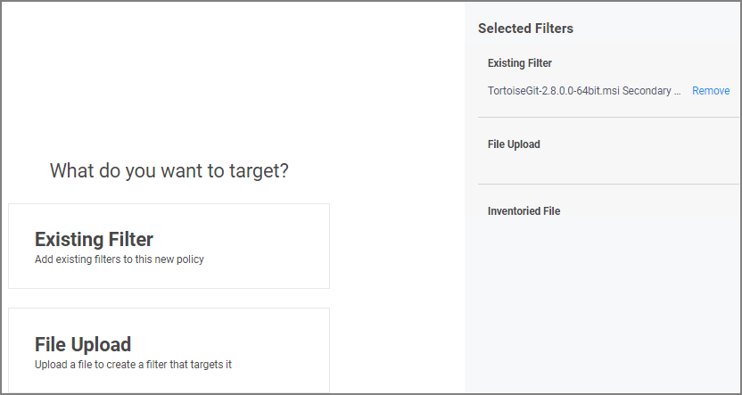
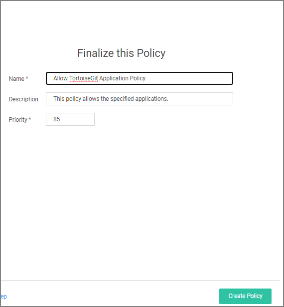
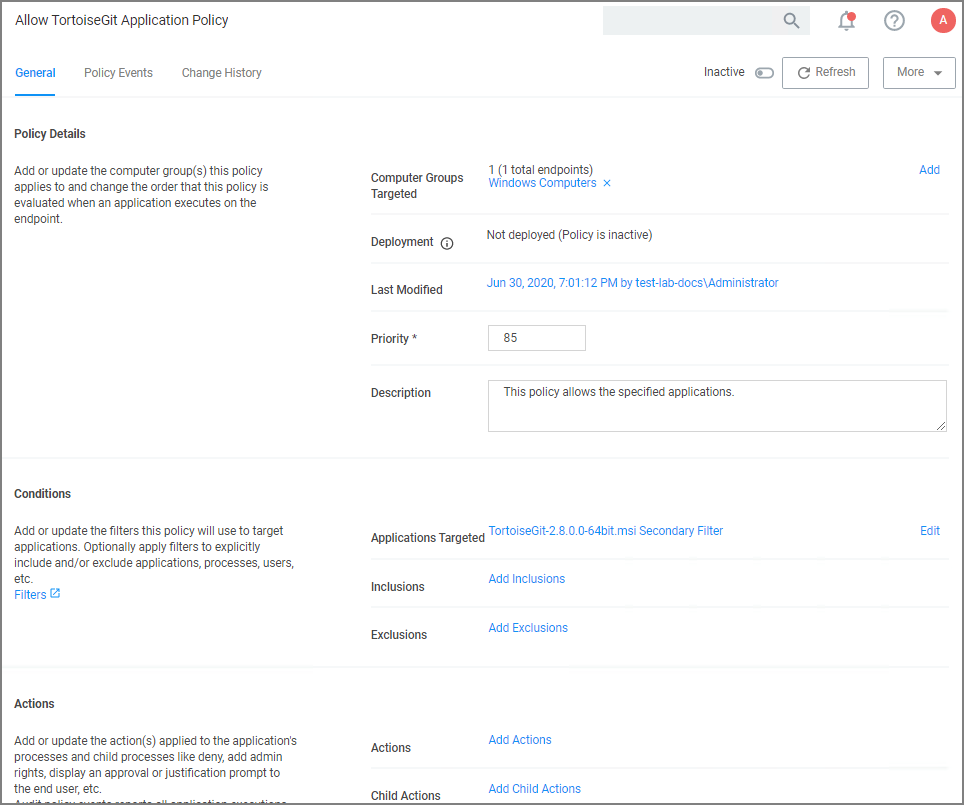

[title]: # (Best Practice)
[tags]: # (secondary file filter, file inventory, create policy)
[priority]: # (2)
# Best Practice Using a Secondary File Filter

## Using File Inventory

As a best practice you create an elevate policy with a priority of X (for example 85) to elevate or allow specific scripts or files to run. Then you add a policy with a priority of X+1 to deny any other execution of the command processor, PowerShell, or Microsoft installer files. For this example .msi is used.

1. In the Privilege Manager Console under __Computer Groups__ navigate to __File Inventory__.
1. From the list of discovered resources, we are selecting our example TortoiseGit.

   
1. Click __Create Filter__.
1. On the Manage Application page, check the __File Name__ and __Signed By__ checkboxes.

   
1. Click __Create Filter__.

   
1. Navigate to __Computer Groups | Windows Computers__.
1. Select __Application Policies__.
1. Click __Create Policy__.
1. In the policy wizard select __Controlling__, click __Next Step__.
1. In the policy wizard select __Allow__, click __Next Step__.
1. In the policy wizard select __Specific Applications__, click __Next Step__.
1. In the policy wizard select __Existing Filter__, click __Next Step__.
   1. Search for and add the secondary file filter created from the file inventory above.
   1. Click __Update__.
1. On the policy wizard page that now lists the existing filter, click __Next Step__.

   
1. Name the policy and click __Create Policy__.

   

The policy wizard added based on the selected filter the application target to allow the TortoiseGit application.

