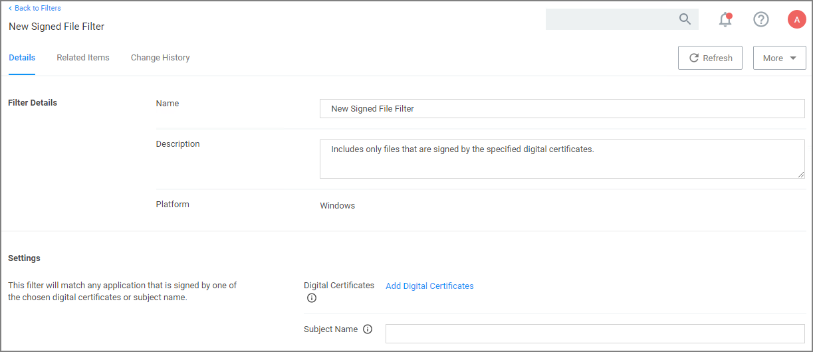

[title]: # (Signed File Filter)
[tags]: # (filter types)
[priority]: # (2)
# Signed File Filter

This filter allows you to associate one or more Digital Certificate(s) that are trusted and verify that an application or file is signed by one of those certificates. *No out-of-box filters exist in Privilege Manager for this type*.

  

These filters can be used in several of the following ways:

* A target for ACS policies
* A parameter to prevent spoofing

Signed Application filters identify applications based on their digital certificates.

This filter is available for both Windows and macOS systems.

## Parameters

Under Settings users: 

* add one or more digital certificates, which are discovered via inventory.
* enter a Subject Name (version __10.7 and up__). If Subject Name is specified, the digital certificates above will be ignored. The following three match types are supported:

  * The `*` character can be pre- or post- appended to a string to perform a begins with or ends with match (i.e. `Microsoft*`).
  * Lower-case RegEx is also supported and must be surrounded with parenthesis. (i.e. `(micro.*)`)
  * Setting the subject name to `*` will match any file signed with a valid certificate. (__Not recommended by Thycotic__)

## Examples

Adobe (TM) requires several certificates that are used to sign applications.

Because of this, you may want all applications signed by Adobe to be whitelisted, so that a signed application filter targeting Adobe Certificates allows all applications signed by Adobe to run.

Targeting the latest Adobe Flash Installer via a Win32 Executable filter and then using the signed application filter ensures that the application really is the adobe flash installer. The Signed Application Filter works as a validation filter for applications.
