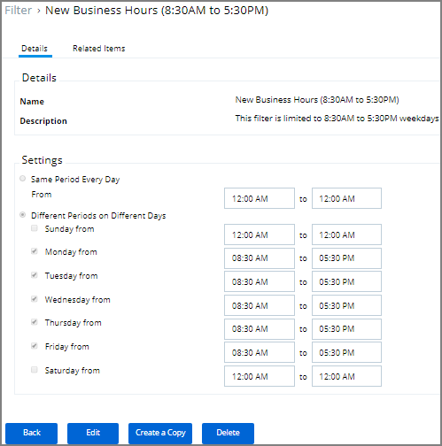

[title]: # (Time of Day)
[tags]: # (filter types)
[priority]: # (2)
# Time of Day Filter

This type of filter exists to create policy parameters for specific time frames.

This filter is available for both Windows and macOS systems.

## Parameters

The time of day filter has two different settings to allow you to set time and day allowances.

* Same period everyday from
* Different Periods on Different Days

## Examples

You can use the time of day filter in a policy to only pickup specific times or days of the week.
