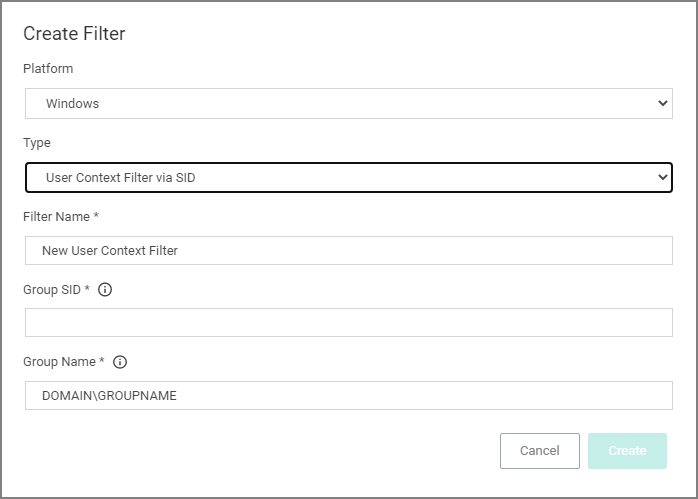

[title]: # (User Context Filters)
[tags]: # (sid)
[priority]: # (2)
# Using User Context Filters

User Context Filters are used in a policy as either an

* inclusion filter,  to specify that the policy only applies to users in a specific AD Group
* exclusion filter, to specify that the policy applies to everyone except the users in a specific AD Group.

The User Context Filters are part of the Application Filter templates listed for Windows:

This filter is available for both Windows and macOS systems.

## On-Premise

For Privilege Manager on-premises the __User Context Filter__ can be used after the Active Directory synchronization completes. When creating and editing the filter, add any 

* Build-in Accounts,
* Well-known Accounts, and/or
* Domain User Groups, or
* Specific Users.

to specifically select user context.

Then select if __ALL__ conditions must be met. Leave the box unchecked to match __ANY__. You can also specify, if accounts must be enabled to be targeted. This is an important checkbox to set if specific users have been added.

## Cloud

For Privilege Manager cloud the __User Context Filter via SID__ can be used if (Azure) AD synchronization has not been set up but the SID of the group is known. When creating the filter, enter the

* Group SID , and
* Group Name, to name the group if it does not exist.

