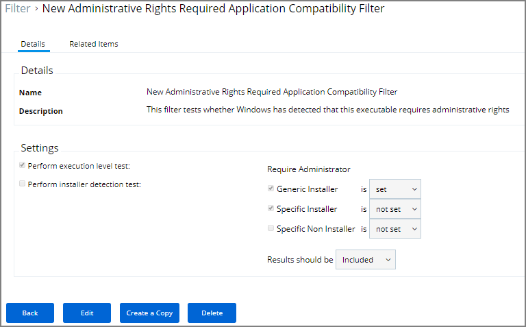

[title]: # (Application Compatibility)
[tags]: # (filter types)
[priority]: # (2)
# Application Compatibility Filter

This type of filter identifies the rights or permissions that an application requires to run.

## Parameters

By default __Perform execution level test__ is set to no, if you change this to Yes, you can specify:

* As Invoker
* Highest Available
* Require Administrator

By default __Perform installer detection test__ is set to no, if you change this to Yes, you can specify:

* Generic Installer to be set or not set.
* Specific Installer to be set or not set.
* Specific Non Installer to be set or not set.
* if the Results should be included or excluded.

Remember to __Save Changes__ after any customization.
