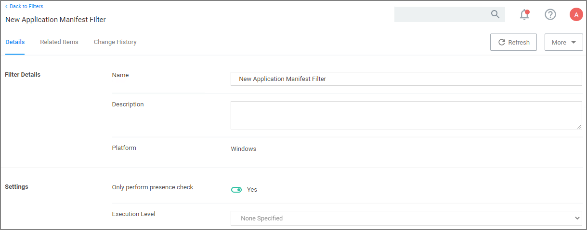

[title]: # (Application Manifest Filter)
[tags]: # (filter types)
[priority]: # (2)
# Application Manifest Filter (“Manifest Filter”)

Applications that declare specific rights required via a manifest, such as applications that need administrative privileges.

## Examples

1. Navigate to __Admin | More…__ and select __Filters__.
1. In the search field for the __Type__ column enter application manifest.

   
1. Select a filter to view its details and/or create a copy to customize the filter.

   

1. Click __Edit__.
1. Set the needed parameters.

   
1. Click __Save__.

   
